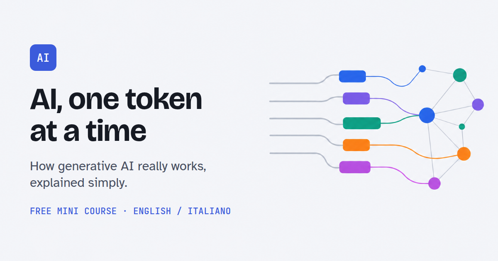

# AI, one token at a time

[](https://maxto.github.io/ai-one-token-at-a-time/)

A short bilingual (Italian / English) course on how generative AI works: 10 modules, 82 lessons, one diagram and one everyday example per idea, a quiz at the end of each module. Not too technical: the goal is a solid mental model, not engineering.

*Un corso breve, in italiano e in inglese, su come funziona l'intelligenza artificiale generativa: 10 moduli, 82 lezioni, un diagramma e un esempio di tutti i giorni per ogni idea, un quiz alla fine di ogni modulo.*

**Read the course / Leggi il corso: https://maxto.github.io/ai-one-token-at-a-time/**

## Contents

| # | Module | Lessons |
|---|---|---|
| 1 | [Foundations](content/01-foundations/) | tokens, embeddings, vector similarity, context window, temperature, top-k/top-p, system/user roles, inference vs training, attention |
| 2 | [Models & architectures](content/02-models-architectures/) | LLMs, SLMs, multimodal, reasoning models, diffusion, encoder vs decoder, mixture of experts, foundation models |
| 3 | [Prompting techniques](content/03-prompting/) | zero-shot, few-shot, chain-of-thought, ReAct, tree of thoughts, self-consistency, role prompting, templates, structured output |
| 4 | [RAG & knowledge](content/04-rag-knowledge/) | retrieval pipelines, vector databases, chunking, embedding models, hybrid search, reranking, knowledge graphs, context injection, from document to text |
| 5 | [Agents & tool use](content/05-agents-tool-use/) | agents, tool calling, MCP, multi-agent systems, memory, planning, agent loops, handoffs, workflow or agent |
| 6 | [Training & fine-tuning](content/06-training-fine-tuning/) | pre-training, fine-tuning, LoRA/QLoRA, RLHF, DPO, instruction tuning, distillation, quantization |
| 7 | [Production, safety & evals](content/07-production-safety-evals/) | prompt caching, KV cache, streaming, cost & latency, observability, guardrails, prompt injection, evals & benchmarks, choosing a model |
| 8 | [Reliability & verification](content/08-reliability-verification/) | hallucinations, knowledge cutoff, confidence and uncertainty, sources and citations, sycophancy, bias, checking an answer |
| 9 | [Privacy & data](content/09-privacy-data/) | a message's journey, history/memory/training, sharing the minimum, anonymization, local or cloud, permissions and connectors, retention and deletion |
| 10 | [Images, audio & video](content/10-images-audio-video/) | how a model sees an image, prompt to image, editing part of an image, reference images, speech, video generation, content provenance |

Each lesson is a Markdown file you can read right here on GitHub. The course page (language switch, search, progress, quizzes) is built from them.

## Build

Requirements: Python 3 (no packages). For the tests: Node.js and Chrome.

```sh
python3 scripts/build.py   # -> dist/index.html (open it in a browser)
npm install                # once, for the tests
npm test                   # build + browser checks
npm run figs               # render every diagram to tests/output/figs/
```

## Contributing a lesson

Read [docs/writing-guide.md](docs/writing-guide.md) and [docs/figure-guide.md](docs/figure-guide.md). A lesson is one `.md` file plus one `.svg` in its module folder. The build validates both.

## Licence

Code (scripts, page template, tests): [MIT](LICENSE). Course content (`content/`): [CC BY 4.0](content/LICENSE.md).

The content was written with AI assistance and reviewed for technical accuracy. Corrections are welcome.
