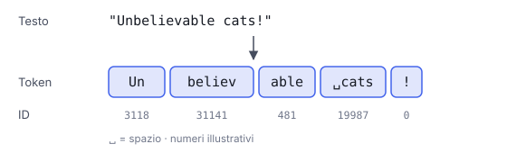

# IT

## In una frase

Un modello linguistico non legge lettere né parole intere: legge token, cioè pezzi di testo presi da un vocabolario fisso.

## Approfondimento

Prima di arrivare al modello, il testo passa da un **tokenizer**, che lo spezza in token: parole comuni intere, pezzi di parole rare, segni di punteggiatura. Spesso lo spazio davanti a una parola fa parte dello stesso token. Ogni token ha un numero in un vocabolario fisso, di solito da decine a centinaia di migliaia di voci. Il vocabolario si costruisce prima dell'addestramento con metodi come il Byte-Pair Encoding (BPE): si parte da singoli caratteri o byte e si uniscono via via le coppie più frequenti nel testo di esempio.

I token contano perché tutto si misura in token: costo, velocità, limiti di lunghezza. In inglese un token vale in media circa ¾ di parola. L'italiano e le lingue meno presenti nei dati di addestramento di solito richiedono più token per dire la stessa cosa.

Il limite: il modello non vede le singole lettere. Per questo può sbagliare compiti banali per noi, come contare le lettere di una parola o scriverla al contrario.

## Esempio for dummies

Una scatola di LEGO ha pezzi standard. Per una casa usi i mattoncini grandi già pronti; per un dettaglio strano unisci tre pezzetti piccoli. Il tokenizer fa lo stesso con il testo: "casa" è un pezzo unico, una parola rara o inventata diventa più pezzi. Il modello vede solo i mattoncini, mai la plastica di cui sono fatti, cioè le singole lettere.

## Errore comune

Credere che un token sia una parola. Un token può essere una parola intera, un pezzo di parola o un segno di punteggiatura, spesso con lo spazio davanti. Il numero di token di un testo quasi mai coincide con il numero di parole.

## Didascalia della figura

La frase viene tagliata in token, spesso con lo spazio attaccato, e ogni token diventa un numero del vocabolario.

# EN

## One line

A language model reads neither letters nor whole words: it reads tokens, chunks of text taken from a fixed vocabulary.

## Deep dive

Before text reaches the model, a **tokenizer** splits it into tokens: common words whole, rare words in pieces, punctuation marks. The space before a word is often part of the same token. Each token maps to a number in a fixed vocabulary, usually tens to hundreds of thousands of entries. The vocabulary is built before training with methods such as Byte-Pair Encoding (BPE): start from single characters or bytes and keep merging the pairs that appear most often in sample text.

Tokens matter because everything is measured in them: cost, speed, length limits. In English a token averages roughly ¾ of a word. Italian, and languages that are rarer in the training data, usually need more tokens to say the same thing.

The limit: the model never sees individual letters. That is why it can fail at tasks that are trivial for us, like counting the letters in a word or spelling it backwards.

## For dummies

A LEGO box comes with standard pieces. For a house you use the big ready-made bricks; for an odd detail you join three small ones. The tokenizer does the same with text: "house" is a single piece, while a rare or made-up word becomes several. The model sees only the bricks, never the plastic they are made of, meaning the individual letters.

## Common mistake

Thinking a token is a word. A token can be a whole word, part of a word or a punctuation mark, often with the preceding space attached. A text's token count almost never matches its word count.

## Figure caption

The sentence is cut into tokens, often with the space attached, and each token becomes a vocabulary number.
