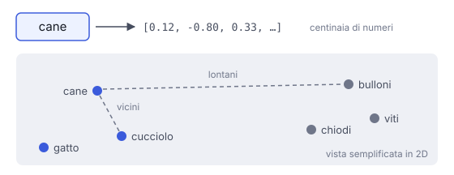

# IT

## In una frase

Un embedding è una lista di numeri che rappresenta il significato di un testo: testi con significato simile hanno numeri vicini.

## Approfondimento

Un **embedding** è un vettore: una lista di centinaia o migliaia di numeri. Ogni numero è una coordinata in uno spazio con molte dimensioni. Il modello impara queste coordinate durante l'addestramento, in modo che testi usati in contesti simili finiscano vicini. "Cane" e "cucciolo" stanno vicini. "Cane" e "bulloni" stanno lontani.

Gli usi sono due. Dentro un modello linguistico, ogni token diventa un embedding prima di qualsiasi elaborazione. Fuori, modelli di embedding dedicati producono un solo vettore per una frase o un documento intero. È la base della ricerca per significato, di cui parla la lezione Similarità tra vettori.

Il limite: le singole dimensioni di rado hanno un significato leggibile. Non esiste la "colonna del colore". L'embedding riflette ciò che il modello ha visto nei dati, pregiudizi compresi. E gli embedding di modelli diversi non si possono confrontare tra loro.

## Nella vita di tutti i giorni

Al supermercato la disposizione non è casuale. La pasta sta vicino ai sughi, i detersivi lontano dalla frutta. Se conosci corsia e scaffale, sai già più o meno cosa troverai. Un embedding è l'indirizzo di un testo in un supermercato con centinaia di coordinate invece di due: la posizione ti dice di cosa parla.

## Errore comune

Pensare che gli embedding funzionino a parole chiave. "Il treno è in ritardo" e "la corsa delle 8 non è ancora arrivata" non hanno parole in comune, eppure risultano vicine. Conta il significato, non le parole uguali.

## Didascalia della figura

Ogni parola diventa una lista di numeri, cioè un punto nello spazio: parole con significato simile finiscono vicine.

# EN

## One line

An embedding is a list of numbers that captures the meaning of a piece of text, so that texts with similar meaning get nearby numbers.

## Deep dive

An **embedding** is a vector: a list of hundreds or thousands of numbers. Each number is a coordinate in a space with many dimensions. The model learns these coordinates during training so that text used in similar contexts ends up close together. "Dog" and "puppy" sit near each other. "Dog" and "bolts" sit far apart.

There are two uses. Inside a language model, every token becomes an embedding before any processing happens. Outside, dedicated embedding models produce a single vector for a whole sentence or document. That is the basis of search by meaning, covered in Vector similarity.

The limit: individual dimensions rarely have a readable meaning. There is no "colour column". An embedding reflects what the model saw in its data, biases included. And embeddings from different models cannot be compared with each other.

## In everyday life

Supermarket layouts are not random. Pasta sits near the sauces, detergents far from the fruit. Know the aisle and the shelf, and you roughly know what you will find. An embedding is a text's address in a store with hundreds of coordinates instead of two: the position tells you what the text is about.

## Common mistake

Thinking embeddings work on keywords. "The train is late" and "the 8 o'clock service hasn't arrived yet" share no words, yet they land close together. What counts is meaning, not matching words.

## Figure caption

Each word becomes a list of numbers, a point in space: words with similar meaning end up close together.
