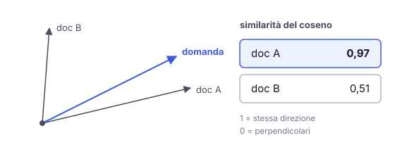

# IT

## In una frase

Per capire se due testi parlano della stessa cosa si misura quanto sono vicini i loro embedding, di solito con la similarità del coseno.

## Approfondimento

La misura più usata è la **similarità del coseno**: guarda l'angolo tra due vettori, non la loro lunghezza. Vale 1 se puntano nella stessa direzione e 0 se sono perpendicolari, cioè senza relazione. In teoria può scendere fino a -1, ma con molti modelli di embedding i valori reali stanno in una fascia stretta. Altre misure sono il prodotto scalare e la distanza euclidea. Su vettori normalizzati danno tutte la stessa classifica.

È il motore della ricerca semantica e del RAG (Retrieval-Augmented Generation): trasformi la domanda in embedding, cerchi i pezzi di documento più vicini e li passi al modello. Con milioni di vettori non si confronta tutto con tutto. I database vettoriali usano indici approssimati, molto più veloci, che però ogni tanto perdono un risultato.

Il limite: vicino non vuol dire giusto né pertinente. "Il negozio apre alle 9" e "il negozio non apre alle 9" possono risultare molto simili.

## Esempio for dummies

In biblioteca chiedi un libro "sui viaggi in treno in Asia". Il bibliotecario non cerca quelle parole esatte nei titoli. Va allo scaffale giusto e prende i libri accanto: guide ferroviarie, diari di viaggio in India, un saggio sulla Transiberiana. La similarità tra vettori fa questo: misura quanto due testi stanno vicini e ti porta i più prossimi, anche se usano parole diverse.

## Errore comune

Leggere il punteggio di similarità come una percentuale di pertinenza o di verità. È solo una misura geometrica. Le soglie utili cambiano da un modello all'altro e vanno tarate sui propri dati.

## Didascalia della figura

La similarità del coseno guarda l'angolo tra i vettori: il documento che punta quasi come la domanda ottiene il punteggio più alto.

# EN

## One line

To tell whether two texts are about the same thing, you measure how close their embeddings are, usually with cosine similarity.

## Deep dive

The most common measure is **cosine similarity**: it looks at the angle between two vectors, not their length. It is 1 when they point the same way and 0 when they are perpendicular, meaning unrelated. In theory it can drop to -1, but with many embedding models real scores sit in a narrow band. Other measures are the dot product and Euclidean distance. On normalised vectors they all give the same ranking.

This is the engine behind semantic search and RAG (Retrieval-Augmented Generation): embed the question, find the closest document chunks, pass them to the model. With millions of vectors you cannot compare everything with everything. Vector databases use approximate indexes, which are much faster but occasionally miss a result.

The limit: close does not mean correct or relevant. "The shop opens at 9" and "the shop does not open at 9" can score as very similar.

## For dummies

At the library you ask for a book "about train travel in Asia". The librarian doesn't scan titles for those exact words. They walk to the right shelf and pull out the neighbours: railway guides, travel diaries from India, a book on the Trans-Siberian. Vector similarity does the same: it measures how close two texts sit and returns the nearest ones, even when they use different words.

## Common mistake

Reading a similarity score as a percentage of relevance or truth. It is only a geometric measure. Useful thresholds differ from one model to another and must be tuned on your own data.

## Figure caption

Cosine similarity looks at the angle between vectors: the document pointing almost the same way as the question scores highest.
