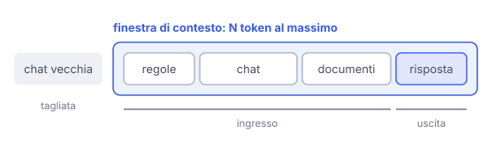

# IT

## In una frase

La finestra di contesto è il numero massimo di token che il modello può considerare in una volta, testo in ingresso e risposta compresi.

## Approfondimento

Il modello non ha memoria tra una chiamata e l'altra. A ogni richiesta riceve tutto da capo: istruzioni, cronologia della chat, documenti allegati. A questo si aggiunge la risposta che sta scrivendo. Tutto deve stare nella **finestra di contesto**, misurata in token. Quando la conversazione supera il limite, l'applicazione deve tagliare o riassumere le parti vecchie.

Le finestre sono cresciute molto, fino a centinaia di migliaia di token e oltre. Ma più contesto costa di più e rallenta: nel meccanismo di attenzione standard il lavoro cresce più che in proporzione alla lunghezza.

E non tutto il contesto viene usato bene. Diversi studi mostrano che i modelli recuperano meglio le informazioni all'inizio e alla fine, e peggio quelle nel mezzo (effetto "lost in the middle"). Un contesto corto e pertinente spesso funziona meglio di uno lungo e pieno di rumore.

## Nella vita di tutti i giorni

Un cuoco lavora su un bancone di misura fissa. Sopra ci sono la ricetta, gli ingredienti e il piatto in preparazione. Se aggiungi altra roba, qualcosa deve finire per terra. E su un bancone troppo pieno anche un cuoco bravo perde di vista il sale, nascosto in mezzo al resto. Il bancone è la finestra di contesto.

## Errore comune

Pensare che il modello "ricordi" le conversazioni passate. Sa solo ciò che è nella finestra in quel momento. Le funzioni di memoria delle app salvano note a parte e le reinseriscono nel contesto.

## Didascalia della figura

Regole, chat, documenti e risposta devono stare tutti nella stessa finestra di token: ciò che non ci sta viene tagliato.

# EN

## One line

The context window is the maximum number of tokens a model can take into account at once, counting both the input and the reply.

## Deep dive

The model has no memory between calls. On every request it gets everything from scratch: instructions, chat history, attached documents. Add to that the reply it is writing. All of it must fit in the **context window**, measured in tokens. When a conversation goes over the limit, the application has to cut or summarise the older parts.

Windows have grown a lot, to hundreds of thousands of tokens and beyond. But more context costs more and runs slower: in standard attention the work grows faster than the length does.

And not all of the context is used equally well. Several studies show that models retrieve information at the start and the end more reliably than information in the middle (the "lost in the middle" effect). A short, relevant context often beats a long, noisy one.

## In everyday life

A cook works on a counter of fixed size. On it sit the recipe, the ingredients and the dish in progress. Pile on more and something has to fall to the floor. And on a cluttered counter even a good cook loses track of the salt, buried somewhere in the middle. The counter is the context window.

## Common mistake

Thinking the model "remembers" past conversations. It only knows what is in the window right now. Memory features in apps store notes separately and feed them back into the context.

## Figure caption

Rules, chat, documents and the reply must all fit in one window of tokens: whatever does not fit gets cut.
