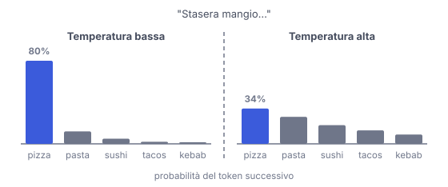

# IT

## In una frase

A ogni passo il modello assegna una probabilità a ogni token possibile, e la temperatura decide quanto rischiare nella scelta del prossimo.

## Approfondimento

Il modello genera un token alla volta. A ogni passo produce un punteggio per ogni token del vocabolario, e questi punteggi diventano probabilità. Poi si **campiona**: si estrae un token secondo quelle probabilità. Il token scelto si aggiunge al testo e il ciclo riparte.

La **temperatura** modifica le probabilità prima dell'estrazione: i punteggi vengono divisi per la temperatura. Sotto 1 la distribuzione si fa più appuntita: i token già probabili lo diventano ancora di più e il testo è più prevedibile. Sopra 1 si appiattisce: escono più spesso token improbabili, il testo è più vario ma anche più esposto a errori e frasi strane. A temperatura 0 si prende sempre il token più probabile.

Il compromesso: bassa per estrarre dati, classificare o scrivere codice, più alta per idee e varianti. Anche a temperatura 0 la risposta può cambiare leggermente tra una richiesta e l'altra, per dettagli tecnici del calcolo sui server.

## Nella vita di tutti i giorni

Nella trattoria sotto casa ordini quasi sempre la carbonara, qualche volta l'amatriciana, di rado il piatto del giorno. Con la temperatura bassa prendi sempre la carbonara: sicuro, ma monotono. Con la temperatura alta ogni tanto ordini la trippa che non hai mai provato. Può essere una scoperta o un disastro. Il menu è lo stesso. Cambia quanto peso dai alle abitudini.

## Errore comune

Pensare che una temperatura alta renda il modello più intelligente o davvero creativo. Non aggiunge conoscenza: cambia solo quanto spesso si scelgono token meno probabili. Se è troppo alta, il testo diventa incoerente.

## Didascalia della figura

Stessi punteggi, due temperature: bassa rende il token più probabile quasi certo, alta dà più chance agli altri.

# EN

## One line

At each step the model gives every possible next token a probability, and temperature decides how much risk to take when picking one.

## Deep dive

The model generates one token at a time. At each step it produces a score for every token in the vocabulary, and those scores become probabilities. Then it **samples**: it draws one token according to those probabilities. The chosen token is appended to the text and the loop starts again.

**Temperature** reshapes the probabilities before the draw: the scores are divided by the temperature. Below 1 the distribution gets sharper: likely tokens become even more likely and the text is more predictable. Above 1 it flattens: unlikely tokens come up more often, so the text is more varied but also more prone to errors and odd phrasing. At temperature 0 the most likely token is always taken.

The trade-off: keep it low for extracting data, classifying or writing code. Raise it for ideas and variations. Even at temperature 0 the output can vary slightly between requests, because of technical details in how servers run the computation.

## In everyday life

At your local trattoria you nearly always order the carbonara, sometimes the amatriciana, rarely the daily special. At low temperature you get the carbonara every time: safe, but dull. At high temperature you now and then order the tripe you have never tried. It might be a discovery or a disaster. The menu stays the same. What changes is how much weight your habits get.

## Common mistake

Believing a high temperature makes the model smarter or truly creative. It adds no knowledge. It only changes how often less likely tokens get picked. Push it too far and the text turns incoherent.

## Figure caption

Same scores, two temperatures: low makes the top token almost certain, high gives the others more of a chance.
