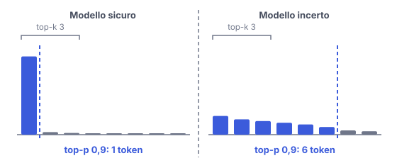

# IT

## In una frase

Top-k e top-p accorciano la lista dei token candidati prima dell'estrazione, così il modello non pesca tra le opzioni assurde.

## Approfondimento

Anche con una temperatura moderata, migliaia di token poco probabili, messi insieme, hanno un peso. Estrarne uno ogni tanto basta a rovinare una frase. Top-k e top-p tagliano questa coda prima dell'estrazione (vedi Temperatura e campionamento).

**Top-k** tiene solo i k token più probabili, per esempio 40, e scarta gli altri. Top-p, detto anche nucleus sampling, tiene i token più probabili finché la loro probabilità sommata raggiunge p, per esempio 0,9. La differenza conta: top-p si adatta. Se il modello è sicuro, uno o due token bastano a raggiungere 0,9. Se è incerto, entrano molti candidati. Top-k invece ne tiene sempre lo stesso numero.

Il limite: queste impostazioni interagiscono tra loro e con la temperatura. Di solito conviene cambiarne una sola alla volta, e alcuni fornitori sconsigliano di modificare insieme temperatura e top-p. Non rendono il modello più preciso: evitano solo le scelte peggiori.

## Esempio for dummies

Cena tra amici, nessuno sa dove andare. Top-k: "scegliamo tra i 3 ristoranti più votati", sempre tre, anche se uno stravince. Top-p: "teniamo i preferiti finché non raccolgono il 90% dei voti". Se tutti vogliono la pizzeria, resta solo quella. Se i gusti sono divisi, la lista si allunga. Poi si tira a sorte tra quelli rimasti, dando più biglietti ai più votati.

## Errore comune

Pensare che top-k e top-p scelgano il token migliore. Decidono solo chi partecipa all'estrazione. La scelta finale resta casuale tra i candidati rimasti, pesata dalle loro probabilità.

## Didascalia della figura

Top-p 0,9 tiene i token più probabili fino al 90%, uno solo se il modello è sicuro e sei se è incerto, mentre top-k 3 ne tiene sempre tre.

# EN

## One line

Top-k and top-p trim the list of candidate tokens before the draw, so the model never picks from the absurd options.

## Deep dive

Even at a moderate temperature, thousands of unlikely tokens add up to real weight. Drawing one of them now and then is enough to wreck a sentence. Top-k and top-p cut off this tail before the draw (see Temperature & sampling).

**Top-k** keeps only the k most likely tokens, say 40, and drops the rest. Top-p, also called nucleus sampling, keeps the most likely tokens until their combined probability reaches p, say 0.9. The difference matters: top-p adapts. When the model is confident, one or two tokens already reach 0.9. When it is unsure, many candidates get in. Top-k always keeps the same number.

The limit: these settings interact with each other and with temperature. It is usually best to change one at a time, and some providers advise against adjusting temperature and top-p together. They do not make the model more accurate. They only rule out the worst choices.

## For dummies

Dinner with friends, and nobody can decide. Top-k: "let's choose among the 3 most voted places", always three, even when one wins by a mile. Top-p: "keep the favourites until they cover 90% of the votes". If everyone wants pizza, only the pizzeria survives. If tastes are split, the list grows. Then you draw lots among those left, giving more tickets to the most popular.

## Common mistake

Thinking top-k and top-p pick the best token. They only decide who gets into the draw. The final choice is still random among the remaining candidates, weighted by their probabilities.

## Figure caption

Top-p 0.9 keeps the most likely tokens up to 90%, just one when the model is confident and six when it is unsure, while top-k 3 always keeps three.
