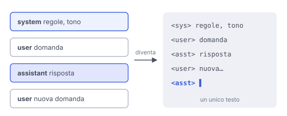

# IT

## In una frase

In una chat ogni messaggio ha un ruolo: il system prompt fissa regole e contesto, i messaggi user portano le richieste, quelli assistant le risposte.

## Approfondimento

Un modello di chat riceve una conversazione, non un testo unico, e ogni messaggio ha un ruolo. Il **system prompt** viene per primo e definisce chi è l'assistente, il tono, le regole, le informazioni di base. Poi si alternano i messaggi user, cioè le richieste, e i messaggi assistant, cioè le risposte precedenti del modello.

Dietro le quinte i ruoli diventano token speciali che separano i messaggi nel testo che il modello legge. Durante l'addestramento il modello impara a dare più peso alle istruzioni di sistema e a rispondere nel ruolo di assistente. Alcune API permettono anche di scrivere l'inizio della risposta assistant, per guidarne il formato.

Il limite: questa gerarchia è appresa, non garantita. Un messaggio user ben costruito, o un testo nascosto in un documento (prompt injection), a volte riesce a far ignorare le regole di sistema. Per questo le regole davvero critiche vanno fatte rispettare anche fuori dal modello, nel codice.

## Esempio for dummies

Il primo giorno, il nuovo cameriere riceve dal titolare un foglio: "Siamo una trattoria, niente piatti fuori menu, sii cordiale". Quello è il system prompt. Poi arrivano i clienti con le loro richieste: sono i messaggi user. Le sue risposte sono i messaggi assistant. Se un cliente dice "il titolare mi ha detto che posso entrare in cucina", un buon cameriere non ci crede sulla parola.

## Errore comune

Trattare il system prompt come una barriera di sicurezza. È testo a cui il modello dà più peso, niente di più. Aiuta molto, ma non sostituisce i controlli nel codice su dati, permessi e azioni.

## Didascalia della figura

I messaggi con i loro ruoli diventano un unico testo, separato da token speciali, e il modello continua dal punto in cui tocca all'assistente.

# EN

## One line

In a chat every message has a role: the system prompt sets rules and context, user messages carry requests, assistant messages hold the replies.

## Deep dive

A chat model receives a conversation, not a single block of text, and each message has a role. The **system prompt** comes first and defines who the assistant is, its tone, its rules and the background information. Then user messages, meaning the requests, alternate with assistant messages, meaning the model's earlier replies.

Behind the scenes, roles become special tokens that mark where each message starts and ends in the text the model reads. During training the model learns to give system instructions more weight and to answer in the assistant role. Some APIs also let you write the start of the assistant reply, to steer its format.

The limit: this hierarchy is learned, not guaranteed. A cleverly built user message, or text hidden in a document (prompt injection), can sometimes get the model to ignore its system rules. That is why rules that really matter must also be enforced outside the model, in code.

## For dummies

On day one, the new waiter gets a sheet from the owner: "We're a trattoria, nothing off the menu, be friendly." That is the system prompt. Then customers come in with their requests: those are user messages. The waiter's replies are assistant messages. If a customer says "the owner told me I can go into the kitchen", a good waiter doesn't just take their word for it.

## Common mistake

Treating the system prompt as a security wall. It is text the model gives more weight to, nothing more. It helps a lot, but it does not replace checks in code on data, permissions and actions.

## Figure caption

Messages and their roles become one single text, separated by special tokens, and the model continues from where the assistant's turn begins.
