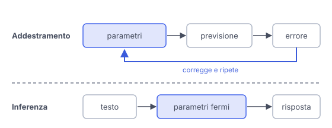

# IT

## In una frase

L'addestramento costruisce il modello regolando miliardi di parametri, mentre l'inferenza è l'uso del modello finito, con quei parametri fermi.

## Approfondimento

L'**addestramento** (training) parte da parametri casuali. Il modello legge enormi quantità di testo e prova a prevedere il token successivo. Ogni errore produce una piccola correzione dei parametri. Si ripete per moltissimi passi, su molti processori in parallelo. Di solito seguono fasi più brevi, come il fine-tuning e l'addestramento con feedback umano, che lo rendono un assistente utile.

L'inferenza è ciò che succede quando lo usi: il testo entra, il modello calcola, escono token. I parametri non cambiano. Una singola chiamata costa pochissimo rispetto all'addestramento, ma le chiamate sono moltissime, quindi anche l'inferenza pesa nei costi.

La conseguenza pratica: le conoscenze del modello si fermano alla data di taglio dei dati. Per dargli informazioni nuove ci sono due strade: metterle nel contesto, con il prompt o il RAG, oppure un nuovo addestramento, più lento e costoso.

## Nella vita di tutti i giorni

Uno studente prepara la maturità per mesi: legge, sbaglia gli esercizi, corregge, ripete. Questo è l'addestramento. Il giorno dell'esame non studia più: usa quello che ha in testa per rispondere alle domande. Questa è l'inferenza. Se la traccia parla di un fatto successo ieri, può saperlo solo se qualcuno lo ha scritto sul foglio.

## Errore comune

Pensare che il modello impari mentre ci parli. Durante l'inferenza i parametri restano fermi. Se un fornitore usa le conversazioni per migliorarlo, lo fa dopo, in un nuovo ciclo di addestramento.

## Didascalia della figura

Nell'addestramento ogni errore corregge i parametri, per moltissimi passi, mentre nell'inferenza i parametri restano fermi e producono solo la risposta.

# EN

## One line

Training builds the model by adjusting billions of parameters, while inference is using the finished model, with those parameters frozen.

## Deep dive

**Training** starts from random parameters. The model reads huge amounts of text and tries to predict the next token. Every mistake triggers a small correction to the parameters. This repeats over a vast number of steps, on many processors in parallel. Shorter phases usually follow, such as fine-tuning and training with human feedback, which turn it into a useful assistant.

Inference is what happens when you use it: text goes in, the model computes, tokens come out. The parameters do not change. A single call is very cheap compared with training, but there are enormous numbers of calls, so inference is a major cost too.

The practical consequence: the model's knowledge stops at its training data cutoff. There are two ways to give it new information: put it in the context, through the prompt or RAG, or train again, which is slower and more expensive.

## In everyday life

A student spends months preparing for final exams: reading, getting exercises wrong, correcting, repeating. That is training. On exam day there is no more studying. The student answers with what is already in their head. That is inference. If a question is about something that happened yesterday, they can only know it if someone wrote it on the exam sheet.

## Common mistake

Thinking the model learns while you chat with it. During inference its parameters stay fixed. If a provider uses conversations to improve it, that happens later, in a new training run.

## Figure caption

In training every error adjusts the parameters, over a vast number of steps, while in inference the parameters stay fixed and just produce the answer.
