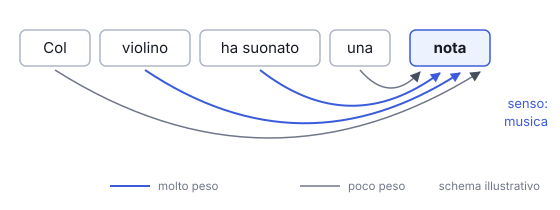

# IT

## In una frase

L'attenzione è il meccanismo con cui il modello, per ogni token, decide quanto peso dare a ciascuno dei token del contesto che può vedere.

## Approfondimento

Una parola da sola è spesso ambigua. "Nota" può essere un suono o un appunto: il senso arriva dalle parole vicine. L'**attenzione** fa questo per ogni token. Dal vettore di ogni token il modello ricava una query, cioè cosa cerca, e una key, cioè cosa offre. La query di un token si confronta con le key dei token visibili e dà un punteggio per ciascuno. I punteggi diventano pesi che sommano a uno, e il token aggiorna il suo vettore mescolando le informazioni di quei token secondo i pesi. Nei modelli che scrivono testo, ogni token vede se stesso e quelli prima, mai quelli dopo.

È il cuore del transformer, l'architettura di quasi tutti i modelli linguistici. Ci sono molti strati di attenzione, e ogni strato ha più "teste" in parallelo, che possono specializzarsi in relazioni diverse, come a chi si riferisce un pronome.

Il costo: nella versione standard ogni token si confronta con tutti quelli visibili. Se il testo raddoppia, i confronti quadruplicano: i contesti lunghi costano di più e sono più lenti.

## Nella vita di tutti i giorni

Al bancone della pizzeria qualcuno grida "la margherita!". Da sola la frase non basta: in forno ce ne sono tre. Per capire se è la tua ripensi a quando hai ordinato, guardi chi era in fila prima di te e ignori la musica e il traffico. Dai molto peso a poche cose utili e quasi nessuno al resto. Il modello fa lo stesso per ogni token del testo, a ogni strato.

## Errore comune

Pensare che i pesi dell'attenzione spieghino perché il modello ha dato una certa risposta. Sono solo un passaggio interno tra tanti. Alcuni studi hanno mostrato che pesi molto diversi possono portare alla stessa previsione.

## Didascalia della figura

Nello schema illustrativo, "nota" riceve più informazioni da "violino" e "suonato", parole utili a distinguerne il senso musicale.

# EN

## One line

Attention is the mechanism by which the model, for each token, decides how much weight to give each token in the context it can see.

## Deep dive

A word on its own is often ambiguous. "Note" can be a sound or a written reminder: the meaning comes from nearby words. **Attention** does this for every token. From each token's vector the model derives a query, what it is looking for, and a key, what it offers. A token's query is compared with the keys of the visible tokens, giving a score for each. The scores become weights that add up to one, and the token updates its vector by blending in information from those tokens by weight. In models that write text, each token sees itself and the ones before it, never the ones after.

It is the core of the transformer, the architecture behind almost every language model. There are many attention layers, and each has several "heads" working in parallel, which can specialise in different relations, such as who a pronoun refers to.

The cost: in the standard version every token is compared with all the ones it can see. Double the text and the comparisons quadruple, so long contexts cost more and run slower.

## In everyday life

At the pizzeria counter someone shouts "margherita!". On its own that is not enough: there are three in the oven. To tell whether it is yours, you think back to when you ordered, check who was ahead of you in the queue, and ignore the music and the traffic. You give a lot of weight to a few useful things and almost none to the rest. The model does the same for every token in the text, at every layer.

## Common mistake

Thinking the attention weights explain why the model gave a certain answer. They are just one internal step among many. Some studies have shown that very different weights can lead to the same prediction.

## Figure caption

In this illustrative diagram, "note" draws more information from "violin" and "played", the words that help pick out its musical sense.
