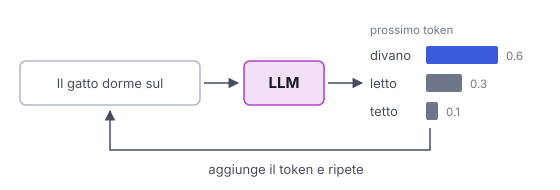

# IT

## In una frase

Un LLM è una rete neurale enorme, addestrata su moltissimo testo, che scrive prevedendo un token alla volta.

## Approfondimento

Un **LLM** (large language model) è una rete neurale, quasi sempre di tipo transformer, con miliardi di parametri: numeri regolati durante l'addestramento. Nella prima fase, il pre-training, il modello legge enormi quantità di testo e impara a prevedere il token successivo (un token è un pezzo di testo: una parola o una sua parte). Per riuscirci deve assorbire grammatica, fatti, stili e schemi di ragionamento.

Poi arriva una seconda fase: fine-tuning su istruzioni ed esempi di dialogo, spesso con feedback umano. È qui che il modello impara a seguire le richieste e a comportarsi da assistente. Quando scrive, genera un token, lo aggiunge al testo e ripete.

Il limite principale: il modello produce testo plausibile, non testo verificato. Può affermare fatti inventati con sicurezza (le cosiddette allucinazioni) e non sa nulla di ciò che è successo dopo la fine dei suoi dati di addestramento, a meno che non gli si diano strumenti o documenti.

## Nella vita di tutti i giorni

Un amico ha letto tutti i libri di una biblioteca enorme, ma non può più entrarci. Gli chiedi una ricetta e lui la ricostruisce a memoria, frase dopo frase, scegliendo ogni volta la parola che suona più giusta. Spesso è perfetta. A volte sbaglia una dose, con lo stesso tono sicuro. E dei libri arrivati dopo la sua ultima visita non sa nulla.

## Errore comune

Errore comune: pensare che un LLM cerchi le risposte in un database o su internet. In realtà genera testo a partire da schemi memorizzati nei suoi parametri. Consulta fonti esterne solo se è collegato a strumenti di ricerca.

## Didascalia della figura

Il modello dà una probabilità a ogni possibile token successivo, ne sceglie uno, lo aggiunge al testo e ripete (numeri illustrativi).

# EN

## One line

An LLM is a very large neural network, trained on vast amounts of text, that writes by predicting one token at a time.

## Deep dive

An **LLM** (large language model) is a neural network, almost always a transformer, with billions of parameters: numbers tuned during training. In the first phase, pre-training, the model reads huge amounts of text and learns to predict the next token (a token is a chunk of text: a word or part of one). To get good at that, it has to absorb grammar, facts, styles and patterns of reasoning.

A second phase follows: fine-tuning on instructions and example dialogues, often with human feedback. This is where the model learns to follow requests and behave like an assistant. When it writes, it generates one token, appends it to the text and repeats.

The main limit: the model produces plausible text, not checked text. It can state invented facts with confidence (so-called hallucinations), and it knows nothing about what happened after its training data ends unless you give it tools or documents.

## In everyday life

A friend has read every book in a huge library but can no longer go inside. You ask for a recipe and they rebuild it from memory, sentence by sentence, each time picking the word that sounds most right. Often it is perfect. Sometimes a quantity is wrong, stated in the same confident tone. And they know nothing about books that arrived after their last visit.

## Common mistake

Common mistake: thinking an LLM looks answers up in a database or on the internet. It actually generates text from patterns stored in its parameters. It only consults outside sources when it is connected to search tools.

## Figure caption

The model gives each possible next token a probability, picks one, appends it to the text and repeats (illustrative numbers).
