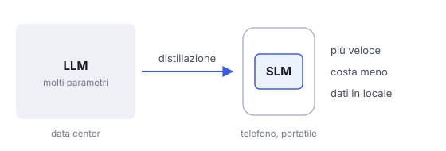

# IT

## In una frase

Uno SLM è un modello linguistico più piccolo, pensato per girare veloce ed economico, anche su un portatile o un telefono.

## Approfondimento

Non esiste una soglia ufficiale, ma di solito si parla di **SLM** (small language model) per modelli da qualche miliardo di parametri o meno. L'architettura è la stessa degli LLM. Cambia la scala, e con essa il costo: meno memoria, meno calcolo, risposte più rapide.

Per farli rendere bene si usano alcune tecniche. Dati di addestramento più curati, non solo più numerosi. La distillazione, in cui un modello grande fa da insegnante e quello piccolo impara a imitarne le risposte. La quantizzazione, che salva i parametri con meno bit, cioè meno precisione, per occupare meno spazio. Il vantaggio pratico è che possono girare in locale: i dati non lasciano il dispositivo e non serve una connessione.

Il compromesso: sanno meno cose e reggono peggio i compiti lunghi e complessi. Rendono al massimo su compiti stretti e ben definiti, soprattutto dopo un fine-tuning mirato.

## Esempio for dummies

In cucina c'è il robot multifunzione con trenta accessori e c'è il pelapatate. Il robot fa quasi tutto, ma occupa mezzo bancone e va montato. Il pelapatate sta in un cassetto, costa poco ed è pronto in un secondo. Se ogni giorno devi solo pelare patate, vince lui. Se devi preparare un menù intero per dieci persone, ti serve il robot.

## Errore comune

Errore comune: considerare uno SLM solo una versione scadente di un LLM. Su un compito specifico, con buoni dati e fine-tuning, può avvicinarsi a modelli molto più grandi, a volte eguagliarli. Perde soprattutto su conoscenza generale e ragionamenti lunghi.

## Didascalia della figura

Un modello piccolo può imparare da uno grande (distillazione) e diventa abbastanza leggero da girare su un telefono o un portatile.

# EN

## One line

An SLM is a smaller language model, built to run fast and cheaply, even on a laptop or a phone.

## Deep dive

There is no official cutoff, but **SLM** (small language model) usually means a model with a few billion parameters or fewer. The architecture is the same as an LLM's. What changes is scale, and with it cost: less memory, less compute, faster answers.

A few techniques help them perform well for their size. Better-curated training data, not just more of it. Distillation, where a large model acts as teacher and the small one learns to imitate its answers. Quantization, which stores parameters with fewer bits, meaning less precision, so they take up less space. The practical benefit is that they can run locally: data stays on the device and no connection is needed.

The trade-off: they know less and struggle more with long, complex tasks. They do best on narrow, well-defined jobs, especially after targeted fine-tuning.

## For dummies

The kitchen has a food processor with thirty attachments, and it has a vegetable peeler. The processor does almost everything, but it takes up half the counter and needs assembling. The peeler fits in a drawer, costs little and is ready in a second. If all you do each day is peel potatoes, the peeler wins. For a full dinner for ten, you want the processor.

## Common mistake

Common mistake: seeing an SLM as just a worse LLM. On a specific task, with good data and fine-tuning, it can come close to much larger models and sometimes match them. It mainly loses out on general knowledge and long reasoning.

## Figure caption

A small model can learn from a large one (distillation) and ends up light enough to run on a phone or a laptop.
