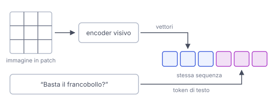

# IT

## In una frase

Un modello multimodale lavora con più tipi di dati insieme, come testo, immagini e audio, e li collega tra loro.

## Approfondimento

Un modello **multimodale** riceve, e a volte produce, più tipi di dati. Il trucco è tradurre tutto nello stesso linguaggio interno: vettori di numeri. Un'immagine viene divisa in piccoli riquadri (patch). Un encoder visivo trasforma ogni riquadro in un vettore, proiettato nello stesso spazio degli embedding delle parole. Da lì il modello tratta pezzi di immagine e token di testo nella stessa sequenza. Per l'audio vale un principio simile.

Così può descrivere una foto, leggere un appunto scritto a mano o rispondere a una domanda su uno screenshot. In uscita, molti modelli generano solo testo. Per creare immagini o voce si usano spesso componenti dedicati.

Limiti: i dettagli fini restano difficili. Contare oggetti, leggere scritte minuscole o capire posizioni precise può fallire. E le immagini consumano molti token, quindi spazio nel contesto e costo.

## Nella vita di tutti i giorni

Al bancone della posta mostri una busta e chiedi: «Basta questo francobollo?». L'impiegato la guarda, legge l'indirizzo, ne stima il peso a occhio e ti risponde. Non serve che tu gli descriva la busta a parole: unisce in un colpo solo quello che vede e la tua domanda. Un modello multimodale fa lo stesso con una foto e un testo.

## Errore comune

Errore comune: credere che il modello trasformi prima l'immagine in una didascalia e poi ragioni solo sul testo. Nei modelli multimodali moderni i pezzi d'immagine diventano vettori elaborati direttamente insieme alle parole.

## Didascalia della figura

I riquadri dell'immagine diventano vettori e finiscono nella stessa sequenza dei token di testo, che il modello elabora insieme.

# EN

## One line

A multimodal model handles several kinds of data together, such as text, images and audio, and connects them to each other.

## Deep dive

A **multimodal** model takes in, and sometimes produces, several types of data. The trick is translating everything into one internal language: vectors of numbers. An image is cut into small squares (patches). A vision encoder turns each patch into a vector, projected into the same space as the word embeddings. From there the model handles image pieces and text tokens in a single sequence. Audio works on a similar principle.

That is how it can describe a photo, read a handwritten note or answer a question about a screenshot. On the output side, many models generate only text. Images or speech are often produced by dedicated components.

Limits: fine detail remains hard. Counting objects, reading tiny print or judging exact positions can fail. And images use up many tokens, which costs context space and money.

## In everyday life

At the post office counter you hold up an envelope and ask: “Is this stamp enough?” The clerk looks at it, reads the address, judges the weight by eye and answers. You don't need to describe the envelope in words: they combine what they see with your question in one go. A multimodal model does the same with a photo and a line of text.

## Common mistake

Common mistake: believing the model first turns the image into a caption and then reasons only about text. In modern multimodal models, image patches become vectors that are processed directly alongside the words.

## Figure caption

Image patches become vectors and join the same sequence as the text tokens, which the model processes together.
