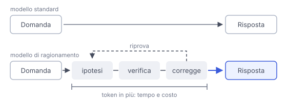

# IT

## In una frase

Un modello di ragionamento scrive una serie di passaggi intermedi prima di rispondere, spendendo più tempo e token sui problemi difficili.

## Approfondimento

Un **modello di ragionamento** è di solito un LLM normale, con la stessa architettura, addestrato in modo diverso. Prima della risposta finale genera una lunga catena di passaggi: prova un'ipotesi, la controlla, torna indietro, riprova. Questa capacità viene rafforzata soprattutto con il reinforcement learning su problemi con soluzione verificabile, come matematica e codice: il modello viene premiato quando arriva al risultato giusto.

L'idea chiave è spendere più calcolo al momento della risposta (test-time compute), non solo durante l'addestramento. Su logica, matematica e programmazione il miglioramento è spesso netto.

Il prezzo: risposte più lente e più costose, perché anche i passaggi intermedi sono token. Su domande semplici può complicare le cose senza motivo. E il ragionamento mostrato non è per forza il vero processo interno che ha prodotto la risposta.

## Nella vita di tutti i giorni

Due studenti ricevono lo stesso problema di geometria. Il primo scrive subito un numero: a volte giusto, a volte no. Il secondo usa la brutta copia: disegna la figura, prova una strada, si accorge di un errore, ricomincia. Ci mette dieci minuti invece di uno, ma sbaglia molto meno. Per dire che ore sono, però, nessuno ha bisogno della brutta copia.

## Errore comune

Errore comune: pensare che sia un tipo nuovo di architettura, o che il ragionamento visibile mostri esattamente come il modello pensa. È lo stesso predittore di token, addestrato a usare più passaggi, e la traccia non è sempre fedele.

## Didascalia della figura

Un modello standard risponde subito, mentre un modello di ragionamento genera prima passaggi intermedi, e li paga in token e tempo.

# EN

## One line

A reasoning model works through intermediate steps before answering, spending more time and tokens on hard problems.

## Deep dive

A **reasoning model** is usually an ordinary LLM, with the same architecture, trained differently. Before the final answer it generates a long chain of steps: it tries an idea, checks it, backtracks, tries again. This skill is mostly strengthened with reinforcement learning on problems whose answers can be checked, such as maths and code: the model is rewarded when it reaches the right result.

The key idea is spending more compute at answer time (test-time compute), not only during training. On logic, maths and programming the gain is often large.

The cost: slower, pricier answers, because the intermediate steps are tokens too. On simple questions it can overcomplicate things. And the reasoning it shows is not necessarily the actual internal process that produced the answer.

## In everyday life

Two students get the same geometry problem. The first writes down a number straight away: sometimes right, sometimes not. The second reaches for scrap paper: draws the figure, tries one approach, spots a mistake, starts over. It takes ten minutes instead of one, but with far fewer errors. To tell someone the time, though, nobody needs scrap paper.

## Common mistake

Common mistake: thinking it is a new kind of architecture, or that the visible reasoning shows exactly how the model thinks. It is the same token predictor, trained to use more steps, and the trace is not always faithful.

## Figure caption

A standard model answers straight away, while a reasoning model first generates intermediate steps, and pays for them in tokens and time.
