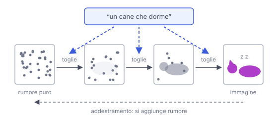

# IT

## In una frase

Un modello di diffusione crea immagini partendo da puro rumore e togliendolo un passo alla volta, guidato da una descrizione testuale.

## Approfondimento

In addestramento si prendono immagini vere e si aggiunge rumore casuale a piccoli passi, fino a ottenere solo puntini a caso. Il modello impara il compito inverso: data un'immagine rumorosa, stimare il rumore da togliere. Per generare, si parte da rumore puro e si ripete questo passaggio molte volte. A ogni giro emerge un po' più di struttura: prima forme vaghe, poi dettagli.

Il prompt entra tramite un encoder di testo che orienta ogni passaggio verso ciò che è descritto. Molti sistemi lavorano in uno spazio compresso (**latent diffusion**) invece che sui pixel, per risparmiare calcolo. Lo stesso principio si usa anche per audio e video.

Il compromesso: servono molti passaggi, quindi la generazione può essere lenta, anche se esistono tecniche per ridurli. E il controllo fine resta difficile: testo leggibile dentro l'immagine, numero esatto di oggetti, disposizioni precise.

## Esempio for dummies

Uno scultore guarda un blocco di marmo grezzo e toglie un po' di pietra, poi un altro po'. All'inizio si intuisce solo una sagoma, poi una testa, infine i dettagli del pelo. Il cliente gli ha chiesto «un cane che dorme», e ogni colpo di scalpello va in quella direzione. Un modello di diffusione fa lo stesso, ma il suo marmo è rumore casuale.

## Errore comune

Errore comune: pensare che il modello incolli pezzi di immagini viste in addestramento. Genera dal rumore usando schemi statistici appresi. Detto questo, a volte può riprodurre quasi identiche immagini molto presenti nei suoi dati.

## Didascalia della figura

Si parte da rumore puro e lo si toglie passo dopo passo, guidati dal prompt, mentre in addestramento si fa il percorso inverso.

# EN

## One line

A diffusion model creates images by starting from pure noise and removing it step by step, guided by a text description.

## Deep dive

During training, real images get random noise added in small steps until only static remains. The model learns the reverse job: given a noisy image, estimate the noise to remove. To generate, you start from pure noise and repeat that step many times. Each round brings out a little more structure: vague shapes first, then details.

The prompt comes in through a text encoder that steers every step toward what is described. Many systems work in a compressed space (**latent diffusion**) rather than on raw pixels, to save compute. The same principle is also used for audio and video.

The trade-off: many steps are needed, so generation can be slow, although there are techniques to cut them down. And fine control remains hard: legible text inside the image, an exact number of objects, precise layouts.

## For dummies

A sculptor faces a rough block of marble and chips some stone away, then a little more. At first only an outline shows, then a head, finally the texture of the fur. The client asked for “a sleeping dog”, and every stroke of the chisel moves that way. A diffusion model does the same, except its marble is random noise.

## Common mistake

Common mistake: thinking the model pastes together pieces of training images. It generates from noise using learned statistical patterns. That said, it can sometimes reproduce near-copies of images that appear very often in its data.

## Figure caption

Generation starts from pure noise and removes it step by step, guided by the prompt, while training runs the opposite way.
