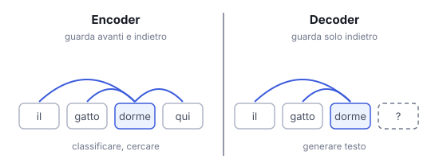

# IT

## In una frase

Encoder e decoder sono due modi di usare il transformer: uno legge tutto il testo insieme, l'altro scrive un token dopo l'altro.

## Approfondimento

Il transformer originale (2017, nato per la traduzione) aveva due metà. L'**encoder** legge la frase intera, e ogni parola può guardare tutte le altre, prima e dopo. Ne esce una rappresentazione ricca del significato. Il decoder genera l'uscita un token alla volta e può guardare solo i token precedenti, più il lavoro dell'encoder.

Da lì sono nate tre famiglie. Solo encoder (come BERT): ottimi per classificare testi e creare embedding per la ricerca. Encoder-decoder: adatti a trasformare un testo in un altro, come tradurre o riassumere. Solo decoder: la base di quasi tutti i chatbot di oggi, perché prevedere il token successivo è un compito generale che cresce molto bene con la scala.

Il compromesso: un encoder vede il contesto in entrambe le direzioni ma non è fatto per scrivere testi lunghi. Un decoder scrive bene ma, a parità di dimensioni, può rendere meno di un encoder su compiti come classificazione o ricerca.

## Esempio for dummies

In una redazione lavorano due persone. Il correttore legge l'articolo intero, avanti e indietro, e capisce di cosa parla: sa dirti l'argomento o trovare l'errore. Lo scrittore invece compone riga dopo riga, e per scegliere la parola successiva guarda solo ciò che ha già scritto. Per tradurre un libro servono entrambi: uno legge l'originale, l'altro scrive la versione nuova.

## Errore comune

Errore comune: credere che i modelli solo decoder sappiano generare ma non capire. La differenza sta in quali token ogni posizione può guardare, non nella comprensione: i grandi decoder gestiscono bene anche testi complessi.

## Didascalia della figura

Nell'encoder ogni token guarda tutti gli altri; nel decoder solo quelli precedenti, perché i successivi non sono ancora stati scritti.

# EN

## One line

Encoders and decoders are two ways of using the transformer: one reads the whole text at once, the other writes one token after another.

## Deep dive

The original transformer (2017, built for translation) had two halves. The **encoder** reads the whole sentence, and every word can look at all the others, before and after. The result is a rich representation of meaning. The decoder generates the output one token at a time and can only look at earlier tokens, plus the encoder's work.

Three families grew from that. Encoder-only (such as BERT): great for classifying text and producing embeddings for search. Encoder-decoder: suited to turning one text into another, like translating or summarizing. Decoder-only: the basis of almost all of today's chatbots, because predicting the next token is a general task that scales very well.

The trade-off: an encoder sees context in both directions but is not built to write long text. A decoder writes well but, at the same size, can do worse than an encoder on tasks like classification or search.

## For dummies

Two people work at a newspaper. The proofreader reads the whole article, back and forth, and grasps what it is about: they can name the topic or spot the error. The writer composes line by line and, to choose the next word, looks only at what is already written. To translate a book you need both: one reads the original, the other writes the new version.

## Common mistake

Common mistake: believing decoder-only models can generate but not understand. The difference lies in which tokens each position can look at, not in comprehension: large decoders handle complex texts well.

## Figure caption

In an encoder every token looks at all the others; in a decoder only at earlier ones, because later ones have not been written yet.
