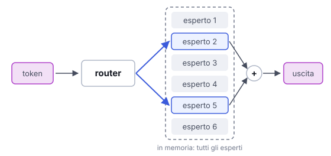

# IT

## In una frase

Un modello Mixture of Experts contiene molte sotto-reti, gli esperti, e per ogni token ne attiva solo poche, scelte da un router.

## Approfondimento

In un transformer classico ogni token passa per tutti i parametri. In un modello **Mixture of Experts** (MoE), dentro ogni strato una parte della rete è divisa in tanti blocchi, gli esperti. Un piccolo componente, il router, guarda ogni token e sceglie i pochi esperti più adatti, una piccola frazione del totale. Gli altri restano fermi per quel token.

Il vantaggio: il modello può avere moltissimi parametri in totale, quindi molta capacità, ma usarne solo una parte per ogni token. Così il calcolo per parola resta vicino a quello di un modello molto più piccolo.

Il compromesso: tutti gli esperti devono comunque stare in memoria, quindi serve hardware con molta memoria. L'addestramento è più delicato: bisogna evitare che il router mandi tutto agli stessi pochi esperti. E distribuire gli esperti su più chip aumenta il traffico di dati tra loro.

## Esempio for dummies

Nella cucina di un grande ristorante ci sono venti cuochi, ma ogni comanda passa solo da due o tre postazioni. Lo chef smista: questa va alla griglia e ai contorni, quella al forno. La brigata sa fare moltissimo, ma ogni piatto impegna poche persone, così la cucina regge tanti ordini. Lo stipendio però va pagato a tutti e venti, anche a chi in quel momento è fermo.

## Errore comune

Errore comune: immaginare ogni esperto come lo specialista di una materia, uno per la medicina, uno per la cucina. Il router sceglie per ogni token e ogni strato, e le specializzazioni sono poco interpretabili, spesso legate più alla sintassi che agli argomenti.

## Didascalia della figura

Il router manda ogni token solo a pochi esperti e ne combina i risultati; tutti gli esperti però restano in memoria.

# EN

## One line

A Mixture of Experts model contains many sub-networks, the experts, and activates only a few of them for each token, picked by a router.

## Deep dive

In a classic transformer every token goes through all the parameters. In a **Mixture of Experts** (MoE) model, part of each layer is split into many blocks, the experts. A small component, the router, looks at each token and picks the few best-suited experts, a small fraction of the total. The rest stay idle for that token.

The benefit: the model can have a huge number of parameters in total, so a lot of capacity, while using only part of them for each token. Compute per word stays close to that of a much smaller model.

The trade-off: all the experts still have to sit in memory, so you need hardware with plenty of it. Training is trickier: you have to stop the router from sending everything to the same few experts. And spreading experts across several chips adds data traffic between them.

## For dummies

A big restaurant kitchen has twenty cooks, but each order passes through only two or three stations. The chef routes them: this one to the grill and sides, that one to the oven. The brigade can do a great deal, yet each dish ties up only a few people, so the kitchen keeps up with many orders. Wages, though, go to all twenty, including whoever is standing idle right now.

## Common mistake

Common mistake: picturing each expert as a subject specialist, one for medicine, one for cooking. The router chooses per token and per layer, and what experts specialize in is hard to interpret, often closer to syntax than to topics.

## Figure caption

The router sends each token to only a few experts and combines their results; all experts still stay in memory.
