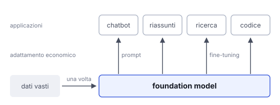

# IT

## In una frase

Un foundation model è un grande modello addestrato su dati vasti e generici, che poi si adatta a moltissimi compiti diversi.

## Approfondimento

Il termine **foundation model** è stato proposto nel 2021 da ricercatori di Stanford. Indica un modello addestrato una volta, su enormi quantità di dati generici, quasi sempre con apprendimento auto-supervisionato (self-supervised): il modello impara da compiti ricavati dai dati stessi, come indovinare la parola mancante, senza etichette scritte a mano.

Da questa base si ricavano molte applicazioni: con un prompt, con il fine-tuning o collegandola ad altri strumenti. Gli LLM sono l'esempio più noto, ma esistono foundation model per immagini, audio, video e perfino proteine. Il vantaggio economico è chiaro: l'addestramento costoso si fa una volta, l'adattamento costa molto meno.

Il rovescio: se la base ha difetti, come errori, lacune o pregiudizi presenti nei dati, li ereditano tutte le applicazioni costruite sopra. Una sola fondazione debole indebolisce molte case.

## Nella vita di tutti i giorni

Per la pizza l'impasto di base è sempre lo stesso: farina, acqua, lievito, ore di lievitazione. È la parte lunga. Poi, in pochi minuti, diventa margherita, focaccia o calzone. Se però l'impasto è venuto male, nessun condimento salva il risultato. Un foundation model è quell'impasto, preparato con cura una volta sola e usato per tanti piatti.

## Errore comune

Errore comune: usare foundation model come sinonimo di chatbot o di LLM. È la categoria più ampia: modelli di base, per qualsiasi tipo di dato, pensati per essere adattati. Un chatbot è una delle applicazioni costruite sopra.

## Didascalia della figura

Un'unica base, addestrata una volta su dati vasti, viene adattata con prompt o fine-tuning a molte applicazioni diverse.

# EN

## One line

A foundation model is a large model trained on broad, general data, which can then be adapted to many different tasks.

## Deep dive

The term **foundation model** was proposed in 2021 by Stanford researchers. It means a model trained once, on huge amounts of general data, almost always with self-supervised learning: the model learns from tasks derived from the data itself, like guessing a missing word, with no hand-written labels.

Many applications are then built on this base: through a prompt, through fine-tuning, or by connecting it to other tools. LLMs are the best-known example, but there are foundation models for images, audio, video and even proteins. The economics are clear: the expensive training happens once, and adaptation costs far less.

The flip side: if the base has flaws, such as errors, gaps or biases in its data, every application built on top inherits them. One weak foundation weakens many houses.

## In everyday life

Pizza dough starts the same way every time: flour, water, yeast, hours of rising. That is the slow part. Then, in minutes, it becomes a margherita, a focaccia or a calzone. If the dough comes out badly, though, no topping can save it. A foundation model is that dough, made carefully once and used for many dishes.

## Common mistake

Common mistake: using foundation model as a synonym for chatbot or LLM. It is the broader category: base models, for any kind of data, meant to be adapted. A chatbot is one application built on top.

## Figure caption

A single base, trained once on broad data, is adapted through prompts or fine-tuning to many different applications.
