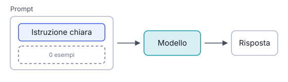

# IT

## In una frase

Chiedere al modello di svolgere un compito con sole istruzioni, senza mostrargli esempi di risposte già fatte.

## Approfondimento

Nello **zero-shot prompting** descrivi il compito e il modello risponde, senza esempi. Funziona perché durante l'addestramento il modello ha visto enormi quantità di testi con compiti simili: riassunti, traduzioni, classificazioni. In più l'instruction tuning, un addestramento extra su coppie istruzione-risposta, gli ha insegnato a seguire richieste scritte in modo diretto.

È il punto di partenza giusto: costa poco, si scrive in fretta e per i compiti comuni basta. La qualità dipende quasi tutta da quanto è chiara l'istruzione. Conviene dire cosa vuoi, per chi, in che formato e con quali vincoli.

Il limite arriva con compiti insoliti o formati molto precisi. Se vuoi un'etichetta tra cinque categorie inventate da te, o uno stile particolare, il modello deve indovinare. Lì conviene passare agli esempi (vedi Few-shot Prompting).

## Esempio for dummies

Un amico ti chiede di portare “qualcosa da bere” alla cena. Non ti dice marca né quantità, ma sai cosa si porta di solito a una cena tra amici e arrivi con due bottiglie di vino e dell'acqua. Hai svolto il compito senza esempi, grazie a ciò che già sapevi. Se invece ti avesse chiesto “il solito di Marco”, senza averti mai mostrato cosa beve Marco, avresti dovuto tirare a indovinare.

## Errore comune

Si pensa che zero-shot significhi prompt brevi e vaghi. In realtà significa solo “senza esempi”: le istruzioni possono, e spesso devono, essere dettagliate su obiettivo, pubblico, formato e vincoli.

## Didascalia della figura

Il prompt contiene solo l'istruzione e nessun esempio: il modello risponde con ciò che ha imparato in addestramento.

# EN

## One line

Asking the model to do a task from instructions alone, without showing it any worked examples.

## Deep dive

In **zero-shot prompting** you describe the task and the model answers, with no examples. It works because pre-training exposed the model to huge amounts of text containing similar tasks: summaries, translations, classifications. Instruction tuning, an extra training stage on instruction-response pairs, then taught it to follow direct requests.

It is the right starting point: cheap, quick to write, and enough for common tasks. Quality depends almost entirely on how clear the instruction is. Say what you want, for whom, in what format and under which constraints.

The limit shows up with unusual tasks or very precise formats. If you want one label out of five categories you invented, or a specific house style, the model has to guess. That is when examples help (see Few-shot Prompting).

## For dummies

A friend asks you to bring “something to drink” to dinner. No brand, no quantity. You know what people usually bring to a dinner among friends, so you turn up with two bottles of wine and some water. You did the task with no examples, using what you already knew. Had they asked for “Marco's usual” without ever showing you what Marco drinks, you would have had to guess.

## Common mistake

People assume zero-shot means a short, vague prompt. It only means “no examples”. The instructions can, and often should, be detailed about goal, audience, format and constraints.

## Figure caption

The prompt holds only the instruction and no examples: the model answers from what it learned in training.
