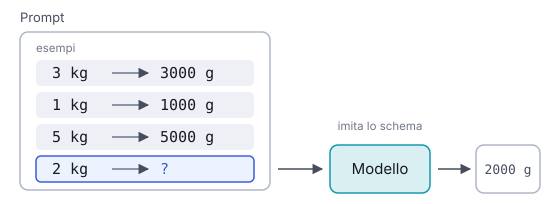

# IT

## In una frase

Mostrare al modello alcuni esempi di input e output desiderati dentro il prompt, così ne imita schema, formato e tono.

## Approfondimento

Nel **few-shot prompting** inserisci nel prompt alcuni esempi completi, di solito da due a cinque, poi il caso nuovo. Il modello non viene riaddestrato: i suoi pesi restano uguali. Riconosce lo schema negli esempi e lo continua. Questo si chiama in-context learning, cioè apprendimento dentro il contesto della singola richiesta.

Gli esempi comunicano cose difficili da descrivere a parole: un formato esatto, un tono, il confine tra due categorie. Spesso un esempio vale più di un paragrafo di istruzioni.

Ci sono dei costi. Ogni esempio occupa token, quindi spazio e denaro a ogni chiamata. Il modello copia anche dettagli che non volevi: se tutti gli esempi sono brevi, le risposte saranno brevi. Se tre su quattro hanno la stessa etichetta, tenderà a sceglierla. Servono esempi vari, rappresentativi e coerenti tra loro. Con i modelli recenti, istruzioni chiare più uno o due esempi bastano spesso.

## Nella vita di tutti i giorni

Primo giorno in biblioteca. La responsabile non ti spiega il sistema di etichette. Ti mette davanti tre libri già catalogati, un romanzo, un atlante e un manuale di cucina, ognuno con la sua etichetta sul dorso. Poi ti passa un quarto libro. Dagli esempi ricavi formato, ordine dei campi e abbreviazioni. Ma se i tre esempi fossero stati tutti romanzi, al primo libro di giardinaggio avresti rischiato di sbagliare.

## Errore comune

Si crede che con gli esempi il modello “impari” in modo permanente. Non è così: gli esempi valgono solo per quella richiesta. Alla chiamata successiva, se non li rimandi, il modello non ne ha traccia.

## Didascalia della figura

Tre esempi completi mostrano lo schema, e per il caso nuovo il modello continua lo stesso schema, senza cambiare i suoi pesi.

# EN

## One line

Putting a few examples of input and desired output in the prompt, so the model copies their pattern, format and tone.

## Deep dive

In **few-shot prompting** you place a few complete examples in the prompt, usually two to five, followed by the new case. The model is not retrained. Its weights stay the same. It spots the pattern in the examples and continues it. This is called in-context learning: learning inside the context of a single request.

Examples convey things that are hard to put into words: an exact format, a tone, the boundary between two categories. One example is often worth a paragraph of instructions.

There are costs. Every example uses tokens, so space and money on every call. The model also copies details you did not intend: if all examples are short, answers will be short. If three out of four share a label, it will lean toward that label. Examples need to be varied, representative and consistent. With recent models, clear instructions plus one or two examples are often enough.

## In everyday life

First day at a library. The head librarian does not explain the labelling system. She puts three catalogued books in front of you, a novel, an atlas and a cookbook, each with a spine label. Then she hands you a fourth. From the examples you work out the format, the order of fields and the abbreviations. But had all three been novels, the first gardening book would probably have tripped you up.

## Common mistake

Many think examples make the model “learn” permanently. They do not. Examples only affect that one request. On the next call, unless you send them again, the model has no trace of them.

## Figure caption

Three complete examples show the pattern, and for the new case the model continues that pattern, with no change to its weights.
