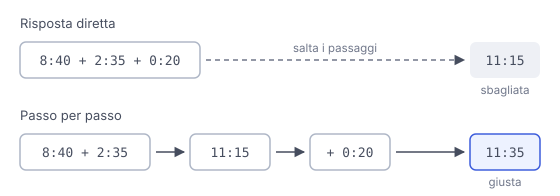

# IT

## In una frase

Far scrivere al modello i passaggi intermedi del ragionamento prima della risposta finale, per migliorare i compiti a più passi.

## Approfondimento

Un modello linguistico genera un token alla volta, e ogni token prodotto entra nel contesto per i successivi. Con il **Chain-of-Thought** (catena di ragionamento) il modello scrive i passaggi intermedi: calcoli parziali, condizioni da controllare. Così ogni passo può appoggiarsi sul precedente, invece di saltare subito alla conclusione. Si ottiene con esempi ragionati oppure con una frase come “ragiona passo per passo”.

Aiuta su problemi di logica, calcoli e pianificazioni con più vincoli. Ha un costo: più token in uscita, quindi più tempo e più spesa.

Con i modelli di ragionamento moderni la frase “pensa passo per passo” conta molto meno: questi modelli ragionano già internamente prima di rispondere. Spesso basta descrivere bene il problema. C'è anche un limite: il ragionamento scritto non è sempre la vera causa della risposta. Può sembrare logico e contenere comunque un errore.

## Esempio for dummies

La maestra chiede: “Il pullman parte alle 8:40, il viaggio dura 2 ore e 35 minuti, più una sosta di 20 minuti. A che ora arriva?” Chi risponde a mente sbaglia spesso. Chi scrive sul quaderno “8:40 più 2:35 fa 11:15, più 20 minuti fa 11:35” arriva giusto, e se sbaglia si vede dove. Scrivere i passaggi non rende più intelligenti. Impedisce di saltarli.

## Errore comune

Si pensa che aggiungere “pensa passo per passo” migliori sempre le risposte. Su compiti semplici aggiunge solo costo, e i modelli di ragionamento lo fanno già da soli. Conta di più descrivere bene il problema.

## Didascalia della figura

Saltando i passaggi il conto si sbaglia facilmente, mentre scrivendo i risultati intermedi ogni passo si appoggia sul precedente.

# EN

## One line

Getting the model to write out intermediate reasoning steps before the final answer, which helps on multi-step tasks.

## Deep dive

A language model generates one token at a time, and each token it produces becomes context for the next. With **Chain-of-Thought** prompting the model writes out intermediate steps: partial calculations, conditions to check. Each step can then build on the previous one instead of jumping straight to a conclusion. You trigger it with worked examples or with a line such as “think step by step”.

It helps on logic problems, arithmetic and planning with several constraints. It has a cost: more output tokens, so more time and more money.

With modern reasoning models, an explicit “think step by step” matters much less, because these models already reason internally before answering. Describing the problem well is often enough. There is also a limit: the written reasoning is not always the real cause of the answer. It can look logical and still contain a mistake.

## For dummies

The teacher asks: “The coach leaves at 8:40, the trip takes 2 hours 35 minutes, plus a 20-minute stop. When does it arrive?” Pupils who answer in their heads often get it wrong. The one who writes “8:40 plus 2:35 is 11:15, plus 20 minutes is 11:35” gets it right, and any slip is easy to spot. Writing the steps does not make you smarter. It stops you skipping them.

## Common mistake

People think adding “think step by step” always improves answers. On simple tasks it only adds cost, and reasoning models already do it on their own. Describing the problem well matters more.

## Figure caption

Skipping the steps makes the sum easy to get wrong, while writing intermediate results lets each step build on the one before.
