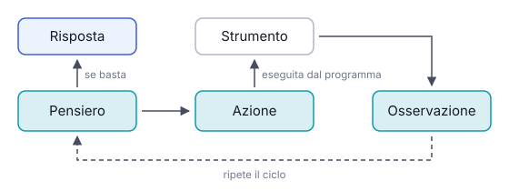

# IT

## In una frase

Uno schema in cui il modello alterna ragionamento e azioni con strumenti esterni, e usa ogni risultato per decidere il passo successivo.

## Approfondimento

**ReAct** (Reason + Act) è stato proposto in un articolo di ricerca del 2022. Il modello lavora in un ciclo: scrive un pensiero (“mi serve l'orario del treno”), sceglie un'azione (cercare sul sito delle ferrovie), riceve un'osservazione (il risultato), poi ragiona di nuovo. L'azione la esegue il programma che ospita il modello, non il modello stesso. Il ciclo continua finché ci sono abbastanza informazioni per rispondere.

Rispetto al solo Chain-of-Thought, il ragionamento si appoggia su dati recuperati dall'esterno, non solo sulla memoria del modello. Questo riduce le invenzioni e permette di usare dati aggiornati. È la base di molti agenti AI di oggi, anche quando lo schema non è scritto in modo esplicito nel prompt.

I limiti: ogni giro costa tempo e token. Il modello può girare a vuoto o scegliere lo strumento sbagliato. Se un risultato è errato, l'errore si porta nei passi successivi. Servono un numero massimo di passi e strumenti descritti bene.

## Esempio for dummies

Stai preparando un risotto. Pensi: “Mi serve il brodo, ce n'è?” Apri la dispensa: c'è un solo dado. Ragioni: “Basta per un litro, me ne serve uno e mezzo.” Controlli il frigo: ci sono verdure. Decidi di fare un brodo veloce. Ogni azione ti dà un'informazione nuova, e ogni informazione cambia il piano. Non hai deciso tutto all'inizio: hai alternato pensiero e verifica.

## Errore comune

Si pensa che in ReAct il modello usi gli strumenti da solo. In realtà scrive solo quale azione vuole fare: è il programma intorno a eseguirla e a restituirgli il risultato.

## Didascalia della figura

Il modello alterna pensiero, azione e osservazione; il programma esegue l'azione con lo strumento, e il ciclo si ripete finché le informazioni bastano.

# EN

## One line

A pattern where the model alternates reasoning with actions on external tools, using each result to decide its next step.

## Deep dive

**ReAct** (Reason + Act) was proposed in a 2022 research paper. The model works in a loop: it writes a thought (“I need the train timetable”), picks an action (search the rail operator's site), gets an observation (the result), then reasons again. The surrounding program runs the action, not the model itself. The loop continues until there is enough information to answer.

Compared with Chain-of-Thought alone, the reasoning rests on data fetched from outside, not just on what the model remembers. That cuts down on made-up answers and allows up-to-date data. It underlies many of today's AI agents, even when the pattern is not spelled out in the prompt.

The limits: each round costs time and tokens. The model can go round in circles or pick the wrong tool. If one result is wrong, the error carries into later steps. You need a cap on the number of steps and well-described tools.

## For dummies

You are making a risotto. You think: “I need stock. Is there any?” You open the cupboard: one stock cube. You reason: “That makes a litre, I need one and a half.” You check the fridge: there are vegetables. You decide to make a quick stock. Each action gives you new information, and each piece of information changes the plan. You did not decide everything up front. You alternated thinking and checking.

## Common mistake

Many believe the model runs the tools itself in ReAct. It only writes which action it wants. The program around it carries out the action and feeds the result back.

## Figure caption

The model alternates thought, action and observation; the program runs the action on the tool, and the loop repeats until there is enough information.
