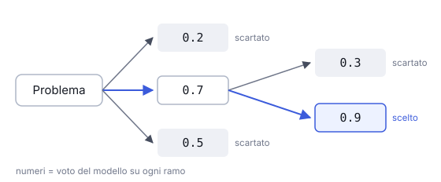

# IT

## In una frase

Esplorare più linee di ragionamento in parallelo, valutarle e scartare quelle deboli, come i rami di un albero di possibilità.

## Approfondimento

Il Chain-of-Thought segue un solo percorso: se il primo passo è sbagliato, lo è anche tutto il resto. Il **Tree of Thoughts**, proposto nel 2023, genera invece più passi alternativi a ogni bivio. Il modello stesso, o un secondo prompt, valuta quali sono promettenti. Un algoritmo di ricerca decide quali rami espandere e quando tornare indietro.

Funziona bene su problemi dove serve esplorare e fare marcia indietro: rompicapi, pianificazioni con vincoli stretti, testi con requisiti rigidi. In questi casi un singolo tentativo lineare fallisce spesso.

Il prezzo è alto. Ogni ramo richiede chiamate al modello, quindi il costo cresce in fretta. Serve anche codice che gestisca l'albero: non è un trucco da scrivere in un solo prompt. Per la maggior parte dei compiti quotidiani è eccessivo, e i modelli di ragionamento moderni fanno già internamente una parte di questa esplorazione.

## Esempio for dummies

Una famiglia organizza una gita di un giorno. Al primo bivio ci sono tre idee: mare, lago, città d'arte. Per ognuna si fa un controllo veloce: tempo di viaggio, meteo, costo del parcheggio. Il mare cade subito, troppo traffico. Su lago e città si va più a fondo: orari dei musei, sentieri, dove mangiare. Quando la città risulta chiusa per una festa locale, si torna indietro e si sceglie il lago.

## Errore comune

Si crede che basti scrivere “considera più opzioni” per avere un Tree of Thoughts. Quello è solo un prompt. Il metodo vero richiede più chiamate, una valutazione dei rami e una logica di ricerca esterna al modello.

## Didascalia della figura

A ogni bivio nascono più passi alternativi: il modello li valuta, i rami deboli vengono scartati e si espande solo quello promettente.

# EN

## One line

Exploring several lines of reasoning in parallel, scoring them and pruning the weak ones, like branches of a tree of possibilities.

## Deep dive

Chain-of-Thought follows a single path: if the first step is wrong, so is everything after it. **Tree of Thoughts**, proposed in 2023, instead generates several alternative steps at each fork. The model itself, or a separate prompt, judges which ones look promising. A search algorithm decides which branches to expand and when to backtrack.

It works well on problems that need exploration and backtracking: puzzles, planning under tight constraints, writing with strict requirements. On these, a single linear attempt often fails.

The price is high. Every branch needs model calls, so cost grows quickly. It also needs code to manage the tree. It is not a trick you write into one prompt. For most everyday tasks it is overkill, and modern reasoning models already do some of this exploration internally.

## For dummies

A family is planning a day trip. At the first fork there are three ideas: seaside, lake, historic town. Each gets a quick check: travel time, weather, parking cost. The seaside drops out at once, too much traffic. Lake and town get a closer look: museum hours, trails, where to eat. When the town turns out to be shut for a local holiday, they backtrack and pick the lake.

## Common mistake

People think writing “consider several options” gives you Tree of Thoughts. That is just a prompt. The real method needs multiple calls, scoring of branches and search logic outside the model.

## Figure caption

Each fork produces several alternative steps: the model scores them, weak branches are pruned and only the promising one is expanded.
