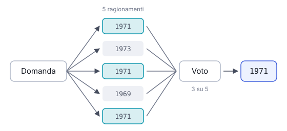

# IT

## In una frase

Generare più risposte indipendenti alla stessa domanda e scegliere quella che compare più spesso, per ridurre gli errori casuali.

## Approfondimento

Con un po' di casualità nel campionamento (regolata dalla temperatura), un modello può dare risposte diverse alla stessa domanda. La **self-consistency**, proposta nel 2022, sfrutta questa variabilità. Si chiede al modello di ragionare più volte in modo indipendente, per esempio cinque o dieci, e si prende la risposta finale più frequente, come in una votazione.

L'idea è che a una risposta giusta si arriva per più strade, mentre gli errori tendono a disperdersi su risultati diversi. Su calcoli e domande con una risposta netta migliora l'accuratezza in modo misurabile.

I limiti sono due. Il costo si moltiplica per il numero di tentativi. E il voto funziona solo se le risposte si possono confrontare: un numero o una scelta tra opzioni sì, un testo libero come un'email no. Inoltre, se il modello sbaglia in modo sistematico, la maggioranza sbaglia con lui.

## Esempio for dummies

Al quiz del pub la squadra non ricorda l'anno di uscita di un album. Invece di fidarsi del primo che parla, ognuno scrive la sua risposta su un foglietto senza guardare gli altri. Quattro scrivono 1971, uno 1973, uno 1969. La squadra mette 1971. Funziona perché gli errori si sparpagliano, mentre il ricordo giusto tende a coincidere. Se però tutti hanno letto la stessa notizia sbagliata, il voto non salva nessuno.

## Errore comune

Si pensa che la risposta più votata sia per forza corretta. La maggioranza riduce gli errori casuali, non quelli sistematici: se il modello ha una convinzione sbagliata, la ripeterà in quasi tutti i tentativi.

## Didascalia della figura

La stessa domanda viene ragionata cinque volte in modo indipendente, e vince la risposta finale più frequente.

# EN

## One line

Generating several independent answers to the same question and picking the most frequent one, to reduce random errors.

## Deep dive

With some randomness in sampling (controlled by the temperature setting), a model can give different answers to the same question. **Self-consistency**, proposed in 2022, puts that variation to use. You ask the model to reason through the problem several times independently, say five or ten, and take the most frequent final answer, like a vote.

The idea is that a correct answer can be reached by several routes, while errors tend to scatter across different results. On arithmetic and questions with a clear-cut answer, it measurably improves accuracy.

There are two limits. Cost multiplies by the number of attempts. And voting only works when answers can be compared: a number or a choice between options works, but free text such as an email does not. Also, if the model is systematically wrong, the majority is wrong with it.

## For dummies

At the pub quiz, the team cannot place the release year of an album. Instead of trusting whoever speaks first, everyone writes an answer on a slip without looking at the others. Four write 1971, one 1973, one 1969. The team goes with 1971. It works because wrong guesses scatter while the right memory tends to agree. If everyone read the same wrong fact, though, the vote saves no one.

## Common mistake

People assume the most-voted answer must be correct. Majority voting reduces random errors, not systematic ones. If the model holds a wrong belief, it will repeat it in almost every attempt.

## Figure caption

The same question is reasoned through five times independently, and the most frequent final answer wins.
