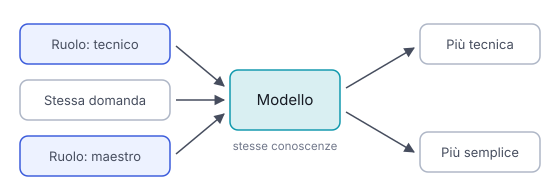

# IT

## In una frase

Assegnare al modello un ruolo o un punto di vista, per orientare tono, lessico, priorità e livello di dettaglio della risposta.

## Approfondimento

Nel **role prompting** apri con un ruolo: “Sei un bibliotecario che aiuta studenti delle superiori.” Il ruolo richiama lo stile e le priorità tipiche di quella figura nei testi che il modello ha visto. Cambiano il lessico, cosa viene detto per primo, quanto si dà per scontato. Spesso il ruolo va nel system prompt, il messaggio iniziale che fissa il comportamento per tutta la conversazione.

Funziona meglio quando il ruolo è specifico e accompagnato dal contesto. “Sei un esperto” dice poco. “Sei un allenatore di nuoto che prepara bambini di otto anni alla prima gara” dice molto di più su pubblico, obiettivo e tono.

Il limite è importante. Un ruolo non aggiunge conoscenze che il modello non ha. “Sei un medico” non lo rende un medico: cambia lo stile, non l'accuratezza. Sulle domande di fatto gli studi mostrano effetti piccoli o incostanti.

## Esempio for dummies

Allo sportello delle poste, la stessa domanda su un pacco smarrito riceve risposte diverse. L'impiegato nuovo legge il regolamento. Quello con vent'anni di servizio ti dice subito quale modulo compilare e a chi telefonare. Il direttore ti parla di tempi e rimborsi. Le regole sono le stesse per tutti: cambia cosa mettono in primo piano. Ma nessuno dei tre sa dirti dove sia il pacco, se nessuno l'ha registrato.

## Errore comune

Si crede che dire “sei un esperto” renda le risposte più corrette. Il ruolo orienta stile e priorità, ma non aggiunge conoscenze. Per risposte migliori servono contesto, dati e istruzioni precise.

## Didascalia della figura

Con la stessa domanda, il ruolo cambia stile e priorità della risposta, mentre le conoscenze del modello restano le stesse.

# EN

## One line

Giving the model a role or viewpoint to steer the tone, vocabulary, priorities and level of detail of its answer.

## Deep dive

In **role prompting** you open with a role: “You are a librarian helping secondary-school students.” The role brings out the style and priorities typical of that figure in the text the model has seen. It changes the vocabulary, what comes first, how much is taken for granted. The role often goes in the system prompt, the opening message that sets behaviour for the whole conversation.

It works best when the role is specific and comes with context. “You are an expert” says little. “You are a swimming coach preparing eight-year-olds for their first race” says much more about audience, goal and tone.

The limit matters. A role does not add knowledge the model lacks. “You are a doctor” does not make it one: it changes the style, not the accuracy. On factual questions, studies show small or inconsistent effects.

## For dummies

At the post office counter, the same question about a lost parcel gets different answers. The new clerk reads out the rules. The one with twenty years' service tells you straight away which form to fill in and whom to call. The manager talks about timelines and refunds. The rules are the same for all three. What changes is what they put first. None of them can tell you where the parcel is if nobody logged it.

## Common mistake

People think “you are an expert” makes answers more correct. A role steers style and priorities, but it adds no knowledge. Better answers come from context, data and precise instructions.

## Figure caption

With the same question, the role changes the answer's style and priorities, while the model's knowledge stays the same.
