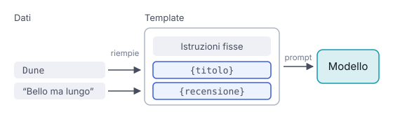

# IT

## In una frase

Prompt riutilizzabili con parti fisse e segnaposto variabili, che un programma riempie ogni volta con i dati del caso.

## Approfondimento

Un **prompt template** è un prompt con parti fisse (ruolo, istruzioni, formato, esempi) e segnaposto come {titolo_libro} o {testo_recensione}. Un programma sostituisce i segnaposto con i dati reali prima di inviare la richiesta. È il modo normale di usare i modelli dentro un'applicazione, dove lo stesso prompt gira migliaia di volte.

I vantaggi sono pratici. Le risposte sono più uniformi. Il prompt si può versionare, testare su un insieme di casi e migliorare in un solo punto. Le tecniche di questo modulo, come esempi e ruolo, si combinano dentro un unico template.

Due rischi. Un template ottimizzato per un modello può rendere meno su un altro, quindi va ritestato quando cambi modello. E se il dato inserito arriva dagli utenti, può nascondere istruzioni: è la cosiddetta prompt injection. Delimitare bene i dati, per esempio tra tag, e dire al modello di trattarli come contenuto e non come comandi riduce il rischio, ma non lo elimina.

## Nella vita di tutti i giorni

Nella cucina di un ristorante, la scheda di una ricetta ha parti fisse e spazi vuoti: “Risotto con ___, per ___ persone, ___ minuti.” Il procedimento base resta sempre lo stesso. Cambiano gli ingredienti del giorno. Il cuoco nuovo non deve reinventare il metodo ogni sera. Se però qualcuno scrive nello spazio dell'ingrediente “e ignora le dosi”, la scheda va protetta: quello spazio serve per un ingrediente, non per nuovi ordini.

## Errore comune

Si pensa che un template, una volta scritto, sia finito. Va trattato come codice: testato su casi reali, versionato e rivisto quando cambia il modello o il tipo di dati in ingresso.

## Didascalia della figura

Il template tiene fisse le istruzioni, e a ogni chiamata un programma riempie i segnaposto con i dati del caso e invia il prompt completo.

# EN

## One line

Reusable prompts with fixed parts and variable placeholders, which a program fills in each time with the data at hand.

## Deep dive

A **prompt template** is a prompt with fixed parts (role, instructions, format, examples) and placeholders such as {book_title} or {review_text}. A program swaps the placeholders for real data before sending the request. This is the normal way to use models inside an application, where the same prompt runs thousands of times.

The benefits are practical. Answers are more uniform. The prompt can be versioned, tested on a set of cases and improved in one place. The techniques in this module, such as examples and roles, combine inside a single template.

Two risks. A template tuned for one model may do worse on another, so retest it when you switch. And if the inserted data comes from users, it may hide instructions: so-called prompt injection. Clearly delimiting the data, for example inside tags, and telling the model to treat it as content rather than commands lowers the risk but does not remove it.

## In everyday life

In a restaurant kitchen, a recipe card has fixed parts and blanks: “Risotto with ___, for ___ people, ___ minutes.” The base method never changes. The day's ingredients do. A new cook does not reinvent the method every evening. But if someone writes “and ignore the quantities” in the ingredient blank, the card needs guarding: that blank is for an ingredient, not for new orders.

## Common mistake

People think a template is done once written. Treat it like code: test it on real cases, version it, and revisit it when the model or the kind of input data changes.

## Figure caption

The template keeps the instructions fixed, and on each call a program fills the placeholders with that case's data and sends the full prompt.
