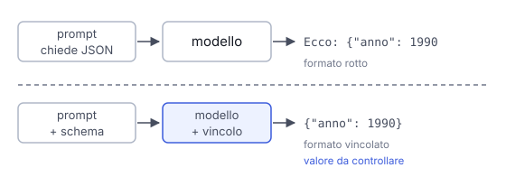

# IT

## In una frase

Un output strutturato segue un formato fisso, come un JSON con campi stabiliti: chiederlo nel prompt aiuta, la decodifica vincolata lo impone.

## Approfondimento

Un programma che usa le risposte di un modello ha bisogno di dati in un formato preciso, per esempio un JSON con i campi titolo, autore e anno. Il modo più semplice è chiederlo nel prompt, magari con un esempio. Di solito funziona, ma a volte arriva una frase in più o manca una parentesi, e il programma si blocca.

Molti servizi permettono di passare uno **schema**, cioè la descrizione esatta dei campi e dei loro tipi. Descriverlo nel prompt aiuta, ma resta una richiesta. Con la decodifica vincolata, a ogni passo vengono esclusi i token che romperebbero lo schema: il modello sceglie solo tra quelli ammessi. Così il formato è vincolato, se la risposta arriva completa.

Il limite: il vincolo riguarda la forma, non il contenuto. Un anno può essere un numero valido e sbagliato. Se l'informazione manca, un campo obbligatorio può favorire invenzioni, soprattutto se lo schema non ammette un valore nullo per indicare il dato mancante. E una risposta interrotta per limite di lunghezza, o un rifiuto, può restare senza struttura.

## Esempio for dummies

Il modulo d'iscrizione della biblioteca ha caselle per nome, data di nascita e telefono, e nella casella della data ci stanno solo cifre. Nessuno può scriverci una poesia. Ma il modulo non sa se la data è vera: si può scrivere una data perfetta e falsa. Dire a voce "scrivi la data in cifre" è come chiederlo nel prompt. Le caselle stampate sono lo schema.

## Errore comune

Credere che una risposta conforme allo schema sia anche giusta. Lo schema controlla che ci siano i campi previsti, con il tipo previsto. Se i valori sono corretti lo dicono solo altri controlli, nel codice o fatti da una persona.

## Didascalia della figura

Con la sola richiesta nel prompt il JSON può arrivare rotto, la decodifica vincolata impone lo schema, ma i valori vanno comunque controllati.

# EN

## One line

Structured output follows a fixed format, like JSON with set fields: asking in the prompt helps, constrained decoding enforces it.

## Deep dive

A program that uses a model's answers needs data in a precise format, for example JSON with the fields title, author and year. The simplest way is to ask for it in the prompt, perhaps with an example. It usually works, but sometimes an extra sentence slips in or a bracket goes missing, and the program breaks.

Many services let you pass a **schema**, an exact description of the fields and their types. Describing it in the prompt helps, but it is still a request. With constrained decoding, at each step the tokens that would break the schema are ruled out, so the model only picks allowed ones. The format is then constrained, as long as the answer arrives complete.

The limit: the constraint covers the shape, not the content. A year can be a valid number and still be wrong. If the information is missing, a required field can encourage made-up values, especially if the schema has no null value for missing data. And an answer cut off by a length limit, or a refusal, can lack the structure.

## For dummies

The library sign-up form has boxes for name, date of birth and phone, and the date box only takes digits. Nobody can write a poem in it. But the form cannot tell whether the date is true: you can write a perfect, false date. Saying out loud "write the date in digits" is like asking in the prompt. The printed boxes are the schema.

## Common mistake

Believing that an answer that matches the schema is also correct. The schema checks that the expected fields are there, with the expected types. Whether the values are right only other checks can tell, in code or by a person.

## Figure caption

With only a request in the prompt the JSON can arrive broken, constrained decoding enforces the schema, but the values still need checking.
