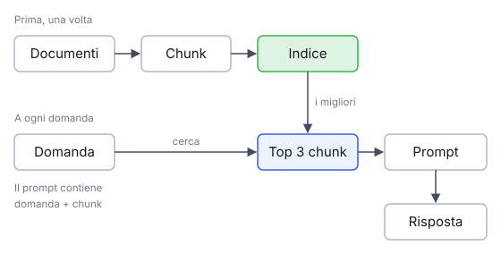

# IT

## In una frase

Una pipeline di recupero è la catena di passaggi che trova i testi giusti e li consegna al modello prima della risposta.

## Approfondimento

Un modello linguistico conosce solo ciò che ha visto in addestramento, fino a una certa data. Non ha mai letto i vostri manuali, le vostre email o il regolamento della palestra. Una **pipeline di recupero** colma questo vuoto in due fasi. Prima l'indicizzazione: i documenti vengono tagliati in pezzi (chunk), trasformati in embedding e salvati in un indice. Poi, a ogni domanda, la domanda viene cercata nell'indice, si prendono i pezzi migliori e si mettono nel prompt accanto alla domanda.

Il vantaggio è grande. Si aggiornano i documenti senza riaddestrare il modello, e si può mostrare la fonte di ogni risposta. Il limite è altrettanto chiaro: il modello risponde bene solo se il recupero trova i pezzi giusti. Se la ricerca sbaglia, il modello risponde con sicurezza partendo da testi sbagliati. Per questo la qualità del recupero si misura a parte, prima di giudicare le risposte.

## Esempio for dummies

Al banco informazioni di una biblioteca chiedete come si coltiva il basilico. Il bibliotecario non risponde a memoria. Va allo schedario, trova tre libri adatti, apre le pagine giuste e le legge prima di parlarvi. La sua risposta è buona quanto le pagine che ha scelto. Se pesca il libro sbagliato, vi spiegherà con grande sicurezza come si coltiva la menta.

## Errore comune

Errore comune: pensare che il RAG "insegni" i documenti al modello. Il modello non cambia affatto. Legge i testi recuperati solo durante quella risposta, poi li dimentica. Se il pezzo giusto non viene recuperato, per il modello non esiste.

## Didascalia della figura

Prima i documenti vengono tagliati e indicizzati; poi ogni domanda cerca nell'indice e i pezzi migliori entrano nel prompt.

# EN

## One line

A retrieval pipeline is the chain of steps that finds the right texts and hands them to the model before it answers.

## Deep dive

A language model only knows what it saw in training, up to a cutoff date. It has never read your manuals, your emails or your gym's rulebook. A **retrieval pipeline** fills that gap in two phases. First comes indexing: documents are split into pieces (chunks), turned into embeddings and stored in an index. Then, for every question, the question is searched against the index, the best pieces are picked and placed in the prompt next to the question.

The payoff is large. You can update documents without retraining the model, and you can show the source behind each answer. The limit is just as clear: the model can only answer well if retrieval finds the right pieces. When search fails, the model answers confidently from the wrong text. That is why retrieval quality is measured on its own, before judging the answers.

## For dummies

At a library help desk, you ask how to grow basil. The librarian does not answer from memory. She goes to the catalogue, finds three suitable books, opens the right pages and reads them before speaking. Her answer is only as good as the pages she picked. If she grabs the wrong book, she will explain with great confidence how to grow mint.

## Common mistake

Common mistake: thinking RAG "teaches" the documents to the model. The model does not change at all. It reads the retrieved text only for that one answer, then forgets it. If the right piece is not retrieved, it does not exist for the model.

## Figure caption

First documents are cut up and indexed; then each question searches the index and the best pieces go into the prompt.
