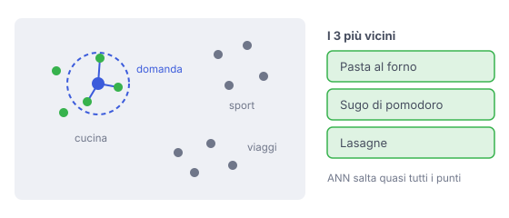

# IT

## In una frase

Un database vettoriale salva gli embedding e trova in fretta quelli più vicini a una domanda, cioè i testi dal significato simile.

## Approfondimento

Ogni pezzo di testo diventa un embedding: una lista di numeri, spesso centinaia o migliaia, che indica un punto in uno spazio. Testi dal significato simile finiscono vicini. Il **database vettoriale** salva questi punti insieme al testo originale e a qualche metadato (autore, data, reparto), e risponde a una sola domanda: quali punti sono più vicini a questo?

Confrontare la domanda con milioni di punti uno per uno sarebbe lento. Per questo si usano indici di ricerca approssimata (ANN, approximate nearest neighbor), come i grafi HNSW, che saltano quasi tutti i confronti. Il prezzo è che ogni tanto un vicino vero viene perso. Si regola il compromesso tra velocità, memoria e precisione.

Non sempre serve un prodotto dedicato. Per poche migliaia di pezzi basta un'estensione del database che già usate, o anche un semplice confronto con tutti i punti.

## Nella vita di tutti i giorni

In un grande supermercato i prodotti non sono in ordine alfabetico. Stanno per affinità: la pasta vicino al sugo, lo shampoo vicino al balsamo. Se cercate il parmigiano, andate nella zona giusta e guardate gli scaffali intorno, senza percorrere ogni corsia. Un database vettoriale fa lo stesso con i testi. Ogni tanto però un prodotto è finito in una corsia inattesa, e non lo vedete.

## Errore comune

Errore comune: credere che il database vettoriale "capisca" i testi. Non capisce nulla. Salva numeri e misura distanze. Tutta la comprensione del significato sta nel modello di embedding che ha prodotto quei numeri.

## Didascalia della figura

Testi simili sono punti vicini: il database restituisce i punti più vicini alla domanda, senza controllarli tutti.

# EN

## One line

A vector database stores embeddings and quickly finds the ones closest to a query, meaning the texts with similar meaning.

## Deep dive

Each piece of text becomes an embedding: a list of numbers, often hundreds or thousands long, that marks a point in space. Texts with similar meaning land close together. A **vector database** stores these points along with the original text and some metadata (author, date, department), and answers one question: which points are nearest to this one?

Comparing a query with millions of points one by one would be slow. So these systems use approximate nearest neighbor (ANN) indexes, such as HNSW graphs, which skip most comparisons. The price is that a true neighbor is occasionally missed. You tune the trade-off between speed, memory and accuracy.

You do not always need a dedicated product. For a few thousand pieces, an extension to the database you already use, or even a plain comparison against every point, is enough.

## In everyday life

In a big supermarket, products are not sorted alphabetically. They sit by affinity: pasta near the sauce, shampoo near the conditioner. To find parmesan, you head to the right area and scan the nearby shelves without walking every aisle. A vector database does the same with texts. Now and then, though, an item has ended up in an unexpected aisle, and you miss it.

## Common mistake

Common mistake: believing the vector database "understands" the text. It understands nothing. It stores numbers and measures distances. All the grasp of meaning lives in the embedding model that produced those numbers.

## Figure caption

Similar texts are nearby points: the database returns the points closest to the query, without checking them all.
