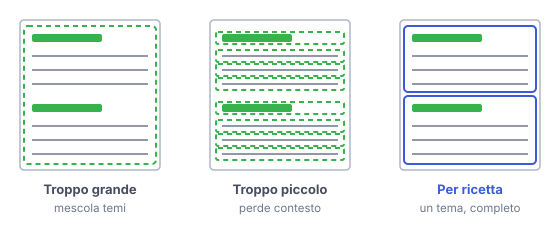

# IT

## In una frase

Il chunking divide i documenti in pezzi da indicizzare; dimensione e confini dei pezzi decidono che cosa la ricerca potrà trovare.

## Approfondimento

Un manuale non si indicizza come un unico blocco. Si taglia in pezzi, detti chunk, e ognuno riceve il suo embedding. Le strategie principali sono tre. Tagli a lunghezza fissa, per esempio qualche centinaio di token, con una piccola sovrapposizione tra un pezzo e il successivo. Tagli che rispettano la struttura: titoli, paragrafi, voci di elenco. Tagli semantici, che spezzano dove cambia l'argomento.

La dimensione è un **compromesso**. Pezzi troppo grandi mescolano più argomenti: l'embedding diventa una media sfocata e la ricerca perde precisione. Pezzi troppo piccoli perdono il contesto: una riga come "cuocere per 20 minuti" non dice di quale ricetta si tratta.

Due rimedi comuni. Aggiungere a ogni pezzo il titolo del documento e della sezione. Oppure cercare su pezzi piccoli e poi passare al modello il brano più ampio che li contiene.

## Esempio for dummies

Dovete digitalizzare un ricettario. Se fotografate il libro intero come un'unica pagina, nessuno troverà mai la ricetta della frittata. Se ritagliate ogni singola riga, trovate "due uova" ma non sapete se servono per la frittata o per il tiramisù. La scelta sensata è una scheda per ricetta, con il titolo scritto in alto. Ogni scheda è completa e parla di una cosa sola.

## Errore comune

Errore comune: cercare la dimensione di chunk "giusta" valida ovunque. Non esiste. Dipende dai documenti e dalle domande: le FAQ e un manuale tecnico chiedono tagli diversi. Si sceglie provando su domande reali e misurando che cosa viene recuperato.

## Didascalia della figura

Lo stesso ricettario tagliato in tre modi: un pezzo unico, una riga per pezzo, un pezzo per ricetta.

# EN

## One line

Chunking splits documents into pieces for indexing; the size and boundaries of those pieces decide what search will be able to find.

## Deep dive

You do not index a whole manual as one block. You cut it into pieces, called chunks, and each gets its own embedding. There are three main strategies. Fixed-length cuts, say a few hundred tokens, with a small overlap between neighbours. Structure-aware cuts that follow headings, paragraphs and list items. Semantic cuts that split where the topic changes.

Size is a **trade-off**. Chunks that are too big mix several topics, so the embedding becomes a blurry average and search loses precision. Chunks that are too small lose context: a line like "bake for 20 minutes" does not say which recipe it belongs to.

Two common fixes. Prefix each chunk with the document and section title. Or search over small chunks, then hand the model the larger passage that contains them.

## For dummies

You are digitising a cookbook. Photograph the whole book as one page, and nobody will ever find the omelette recipe. Cut out every single line, and you will find "two eggs" without knowing whether they belong to the omelette or the tiramisu. The sensible choice is one card per recipe, with its title at the top. Each card is complete and covers one thing.

## Common mistake

Common mistake: hunting for one "right" chunk size that works everywhere. There is none. It depends on the documents and the questions: FAQs and a technical manual need different cuts. You choose by testing on real questions and measuring what gets retrieved.

## Figure caption

The same cookbook cut three ways: one single piece, one line per piece, one piece per recipe.
