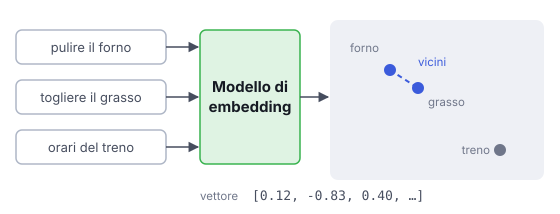

# IT

## In una frase

Un modello di embedding trasforma un testo in una lista di numeri, in modo che testi dal significato simile abbiano numeri vicini.

## Approfondimento

Un embedding è un vettore: una lista di numeri di lunghezza fissa. Il **modello di embedding** è una rete neurale addestrata su moltissime coppie di testi che si corrispondono, come una domanda e la sua risposta. Impara a mettere vicini i testi simili per significato e lontani gli altri. La vicinanza si misura di solito con la similarità del coseno, cioè quanto due vettori puntano nella stessa direzione.

Così "come pulire il forno" trova anche "togliere il grasso incrostato", senza parole in comune. La scelta del modello conta: lingue supportate, ambito (testi medici, codice, testi generici), lunghezza massima del testo in ingresso.

Un vincolo pratico: domande e documenti vanno trasformati con lo stesso modello. Vettori di modelli diversi non sono confrontabili. Se cambiate modello, dovete ricalcolare l'intero indice.

## Esempio for dummies

Su una mappa delle canzoni, ogni brano ha coordinate decise da ritmo, umore e strumenti. Le ballate malinconiche stanno in un angolo, i pezzi da ballare in un altro. Una playlist "simili a questa" prende semplicemente le canzoni vicine. Il modello di embedding è chi disegna la mappa. Se due cartografi diversi disegnano due mappe, le coordinate dell'una non hanno senso sull'altra.

## Errore comune

Errore comune: pensare che vicinanza significhi "risposta giusta". L'embedding misura somiglianza, non verità né pertinenza esatta. "Il negozio apre alle 9" e "il negozio non apre alle 9" possono risultare quasi identici. Negazioni e numeri sono punti deboli noti.

## Didascalia della figura

Il modello trasforma ogni testo in un vettore: frasi con lo stesso significato finiscono vicine anche senza parole in comune.

# EN

## One line

An embedding model turns text into a list of numbers so that texts with similar meaning end up with nearby numbers.

## Deep dive

An embedding is a vector: a fixed-length list of numbers. An **embedding model** is a neural network trained on huge numbers of matching text pairs, such as a question and its answer. It learns to place texts with similar meaning close together and unrelated ones far apart. Closeness is usually measured with cosine similarity, which checks how far two vectors point the same way.

That is how "how to clean the oven" can find "removing baked-on grease" with no words in common. The choice of model matters: supported languages, domain (medical text, code, general text) and maximum input length.

One practical constraint: queries and documents must go through the same model. Vectors from different models cannot be compared. If you switch models, you must re-embed the whole index.

## For dummies

On a map of songs, each track gets coordinates from its rhythm, mood and instruments. Sad ballads cluster in one corner, dance tracks in another. A "more like this" playlist simply picks nearby songs. The embedding model is the one who draws the map. If two different mapmakers draw two maps, coordinates from one mean nothing on the other.

## Common mistake

Common mistake: assuming closeness means "correct answer". Embeddings measure similarity, not truth or exact relevance. "The shop opens at 9" and "the shop does not open at 9" can come out almost identical. Negations and numbers are known weak spots.

## Figure caption

The model turns each text into a vector: sentences with the same meaning land close together even with no words in common.
