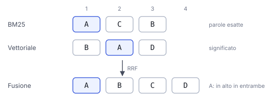

# IT

## In una frase

La ricerca ibrida unisce la ricerca per parole chiave (BM25) e quella vettoriale, per cogliere sia le parole esatte sia il significato.

## Approfondimento

La ricerca per parole chiave è vecchia ma solida. L'algoritmo più usato, **BM25**, premia i documenti che contengono le parole della domanda, dà più peso alle parole rare e tiene conto della lunghezza del testo. Funziona benissimo con nomi propri, codici prodotto, sigle. Però non sa che "auto" e "macchina" sono la stessa cosa.

La ricerca vettoriale ha i difetti opposti: capisce i sinonimi, ma può mancare un codice esatto come "XR-200". La ricerca ibrida esegue entrambe e fonde i risultati. Un metodo semplice e diffuso è la Reciprocal Rank Fusion: usa la posizione di ogni documento in ciascuna classifica, non i punteggi grezzi, che hanno scale diverse.

Il costo è un secondo indice da mantenere e un parametro in più da regolare. In cambio, il recupero di solito diventa più robusto.

## Esempio for dummies

Vi serve un ricambio per l'aspirapolvere. Un commesso guarda solo il codice stampato sul pezzo: se il codice è giusto, lo trova subito. Un altro ascolta la descrizione, "quel tubo snodato che si aggancia sotto", e capisce cosa intendete anche senza codice. Chiedere a entrambi e confrontare le loro proposte funziona meglio che fidarsi di uno solo.

## Errore comune

Errore comune: considerare la ricerca per parole chiave superata dagli embedding. Non lo è. Su nomi, codici e termini rari spesso batte la ricerca vettoriale. Molti sistemi funzionano meglio proprio perché le usano insieme.

## Didascalia della figura

Due classifiche dello stesso archivio, per parole chiave e per significato, fuse in base alla posizione: vince chi è in alto in entrambe.

# EN

## One line

Hybrid search combines keyword search (BM25) with vector search, to catch both exact words and meaning.

## Deep dive

Keyword search is old but solid. The most common algorithm, **BM25**, rewards documents that contain the query's words, gives more weight to rare words and accounts for text length. It excels at names, product codes and acronyms. But it does not know that "car" and "automobile" mean the same thing.

Vector search has the opposite flaws: it handles synonyms but can miss an exact code like "XR-200". Hybrid search runs both and merges the results. A simple, widely used method is Reciprocal Rank Fusion: it uses each document's position in each ranking, not the raw scores, which live on different scales.

The cost is a second index to maintain and one more setting to tune. In return, retrieval usually becomes more robust.

## For dummies

You need a spare part for your vacuum cleaner. One shop assistant only checks the code printed on the part: give him the right code and he finds it at once. Another listens to your description, "that bendy hose that clips on underneath", and gets it with no code at all. Asking both and comparing their picks works better than trusting either alone.

## Common mistake

Common mistake: treating keyword search as obsolete now that embeddings exist. It is not. On names, codes and rare terms it often beats vector search. Many systems work better precisely because they use both.

## Figure caption

Two rankings of the same archive, by keywords and by meaning, merged by position: whatever ranks high in both wins.
