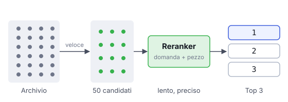

# IT

## In una frase

Il reranking riordina i primi risultati della ricerca con un modello più attento, per portare in cima i pezzi davvero utili.

## Approfondimento

La prima ricerca deve essere veloce, quindi è approssimata. Gli embedding di domanda e documento vengono calcolati separatamente e poi confrontati: il modello non li legge mai insieme. Il **reranker**, spesso un cross-encoder, fa il contrario. Riceve la domanda e un singolo pezzo nello stesso input e valuta quanto quel pezzo risponde davvero alla domanda.

Questo giudizio è molto più preciso, ma anche molto più lento, perché va ripetuto per ogni coppia. Per questo si lavora in due fasi: la ricerca prende, per esempio, i primi 50 o 100 candidati, il reranker li riordina e solo i migliori 5 o 10 arrivano al modello.

Il limite: il reranker non può recuperare ciò che la prima fase ha scartato. Riordina, non cerca.

## Esempio for dummies

Una scuola di musica cerca un insegnante di chitarra. La segreteria scorre duecento curriculum in un'ora e ne tiene venti, guardando parole come "chitarra" e "insegnamento". Poi il direttore incontra i venti uno per uno, li ascolta suonare e sceglie i tre migliori. Non vedrà mai chi la segreteria ha scartato, quindi il primo filtro deve essere largo.

## Errore comune

Errore comune: pensare che il reranking renda inutile una buona ricerca iniziale. Il reranker vede solo i candidati che riceve. Se il pezzo giusto non è tra quelli, nessun riordino lo farà comparire.

## Didascalia della figura

La ricerca veloce sceglie i candidati; il reranker legge domanda e pezzo insieme e li rimette in ordine.

# EN

## One line

Reranking reorders the top search results with a more careful model, so the truly useful pieces rise to the top.

## Deep dive

The first search must be fast, so it is approximate. Query and document embeddings are computed separately and then compared: the model never reads them together. A **reranker**, often a cross-encoder, does the opposite. It takes the query and one chunk in the same input and judges how well that chunk actually answers the question.

That judgement is far more accurate but also far slower, because it must run once per pair. So the work is split in two stages: search fetches, say, the top 50 or 100 candidates, the reranker reorders them, and only the best 5 or 10 reach the model.

The limit: a reranker cannot rescue what the first stage left out. It reorders; it does not search.

## For dummies

A music school is hiring a guitar teacher. The office skims two hundred CVs in an hour and keeps twenty, looking for words like "guitar" and "teaching". Then the director meets those twenty one by one, hears them play and picks the best three. She never sees anyone the office dropped, so the first filter has to be generous.

## Common mistake

Common mistake: thinking reranking makes a good first-stage search unnecessary. The reranker only sees the candidates it is given. If the right chunk is not among them, no amount of reordering will bring it back.

## Figure caption

Fast search picks the candidates; the reranker reads query and chunk together and puts them back in order.
