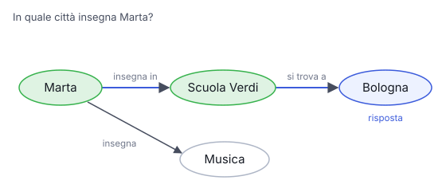

# IT

## In una frase

Un grafo di conoscenza salva i fatti come entità collegate da relazioni, così si possono seguire catene di collegamenti invisibili alla ricerca per somiglianza.

## Approfondimento

In un **grafo di conoscenza** i fatti sono triple: soggetto, relazione, oggetto. "Marta, insegna in, Scuola Verdi". "Scuola Verdi, si trova a, Bologna". Le entità sono nodi, le relazioni sono archi. Il grafo si può costruire a mano o estrarre dai testi con un modello linguistico, i cui errori però vanno controllati.

Il punto forte sono le domande a più passaggi. "In quale città insegna Marta?" richiede di unire due fatti scritti in documenti diversi. La ricerca vettoriale trova pezzi simili alla domanda, ma non segue i collegamenti. Il grafo sì. Approcci come GraphRAG combinano le due cose: usano il grafo per raccogliere fatti collegati o riassunti per tema, poi li passano al modello.

Il prezzo è alto: costruire e tenere aggiornato un grafo richiede lavoro, e uno schema pensato male lo rende rigido.

## Nella vita di tutti i giorni

Sul muro del soggiorno è appeso l'albero genealogico di famiglia. Da nessuna parte c'è scritto "Luca è cugino di Sara". Però una linea dice che Luca è figlio di Anna, un'altra che Sara è figlia di Paolo, un'altra che Anna e Paolo sono fratelli. Seguendo le linee, la parentela salta fuori in pochi secondi. Una pila di lettere sparse conterrebbe gli stessi fatti, ma nessuno li collegherebbe.

## Errore comune

Errore comune: vedere grafi e ricerca vettoriale come rivali. Rispondono a bisogni diversi. Il vettoriale trova testi simili, il grafo segue relazioni precise. Molti sistemi usano il grafo solo per le domande che richiedono collegamenti.

## Didascalia della figura

Due fatti scritti in documenti diversi diventano archi collegati: seguendo il percorso si arriva alla risposta in due passi.

# EN

## One line

A knowledge graph stores facts as entities linked by relations, so you can follow chains of links that similarity search cannot see.

## Deep dive

In a **knowledge graph**, facts are triples: subject, relation, object. "Marta, teaches at, Verdi School." "Verdi School, is located in, Bologna." Entities are nodes and relations are edges. The graph can be built by hand or extracted from text with a language model, whose mistakes then need checking.

Its strength is multi-step questions. "Which city does Marta teach in?" requires joining two facts written in different documents. Vector search finds chunks that look like the question, but it does not follow links. A graph does. Approaches such as GraphRAG combine the two: they use the graph to gather connected facts or topic summaries, then pass them to the model.

The cost is high: building and maintaining a graph takes effort, and a badly planned schema makes it rigid.

## In everyday life

The family tree hangs on the living-room wall. Nowhere does it say "Luca is Sara's cousin". But one line shows Luca is Anna's son, another that Sara is Paolo's daughter, another that Anna and Paolo are siblings. Follow the lines and the relationship appears in seconds. A pile of scattered letters would hold the same facts, but nobody would connect them.

## Common mistake

Common mistake: treating graphs and vector search as rivals. They serve different needs. Vectors find similar text. Graphs follow exact relations. Many systems call on the graph only for questions that need connections.

## Figure caption

Two facts from different documents become linked edges: following the path reaches the answer in two hops.
