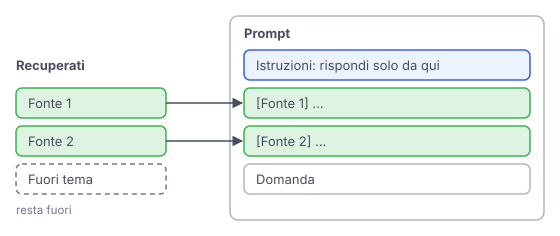

# IT

## In una frase

L'iniezione del contesto è il passo finale: i pezzi recuperati entrano nel prompt, insieme alle istruzioni su come usarli.

## Approfondimento

Il modello vede solo il testo nella sua finestra di contesto. L'**iniezione del contesto** decide che cosa ci entra e come. Di solito i pezzi vanno in una sezione separata e ben marcata, ciascuno con la sua fonte, seguiti dalla domanda. Le istruzioni chiedono al modello di rispondere solo da quei testi, di citare la fonte e di dire "non lo so" se l'informazione manca.

Più testo non vuol dire risposte migliori. I pezzi irrilevanti distraggono il modello, e alcuni studi hanno mostrato che le informazioni a metà di un contesto lungo vengono usate peggio di quelle all'inizio o alla fine ("lost in the middle"). Ogni token in più costa anche tempo e denaro.

C'è anche un rischio di sicurezza: un documento recuperato può nascondere istruzioni proprie (prompt injection). Il testo recuperato va trattato come dato, non come comando.

## Nella vita di tutti i giorni

Un amico parte per Vienna e vi chiede consigli sul treno. Potreste rovesciargli addosso tutte le guide che avete in casa. Meglio dargli tre pagine segnate con un post-it, dirgli da quale guida viene ciascuna e aggiungere: "se qui non c'è, chiedi in stazione". Riceve meno carta, ma risponde meglio alle sue domande e sa quando fermarsi.

## Errore comune

Errore comune: credere che con finestre di contesto molto grandi il recupero non serva più. Riempire il contesto costa, rallenta e diluisce l'attenzione del modello. Scegliere i pezzi giusti resta importante anche quando ci starebbe tutto.

## Didascalia della figura

Nel prompt entrano le istruzioni, solo i pezzi utili con la loro fonte e la domanda, mentre il pezzo fuori tema resta fuori.

# EN

## One line

Context injection is the final step: retrieved chunks are placed into the prompt, together with instructions on how to use them.

## Deep dive

The model only sees what is in its context window. **Context injection** decides what goes in and how. Typically the chunks go in a separate, clearly marked section, each with its source, followed by the question. The instructions tell the model to answer only from those texts, cite the source, and say "I don't know" when the information is missing.

More text does not mean better answers. Irrelevant chunks distract the model, and research has shown that information in the middle of a long context is used less well than information at the start or end ("lost in the middle"). Every extra token also costs time and money.

There is a security risk too: a retrieved document can hide instructions of its own (prompt injection). Retrieved text must be treated as data, not as commands.

## In everyday life

A friend is off to Vienna and asks you about the train. You could dump every guidebook you own on him. Better to hand him three pages marked with sticky notes, tell him which guide each came from, and add: "if it's not here, ask at the station". He gets less paper, answers his own questions better, and knows when to stop.

## Common mistake

Common mistake: believing huge context windows make retrieval unnecessary. Filling the context costs money, adds delay and dilutes the model's attention. Choosing the right pieces still matters even when everything would fit.

## Figure caption

The prompt gets the instructions, only the useful chunks with their sources, and the question, while the off-topic chunk stays out.
