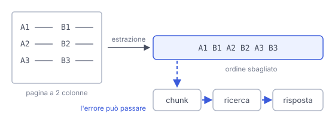

# IT

## In una frase

Prima di indicizzare un documento bisogna estrarne testo affidabile: gli errori fatti in questo passaggio possono propagarsi fino alla risposta.

## Approfondimento

Un sistema RAG lavora su testo, ma i documenti arrivano come PDF, scansioni, pagine web. Un PDF di solito non contiene frasi in ordine: contiene caratteri con una posizione sulla pagina, e chi estrae il testo deve ricostruire l'ordine di lettura. Con due colonne può mescolare le righe di sinistra con quelle di destra. Una tabella può diventare una fila di numeri senza intestazioni. Titoli di pagina e numeri di pagina finiscono in mezzo alle frasi.

Una scansione è solo un'immagine. Serve l'**OCR**, il riconoscimento ottico dei caratteri, che a volte scambia lettere simili, come "rn" e "m", o salta parole sbiadite. Per i casi difficili esistono strumenti che riconoscono la struttura della pagina, o modelli multimodali che la leggono come immagine, ma possono sbagliare anche loro.

Gli errori poi possono propagarsi. Un pezzo di testo confuso dà un embedding confuso, e questo può compromettere la ricerca: il modello rischia di rispondere senza l'informazione giusta. Esistono correzioni dopo l'OCR, automatiche o manuali, ma senza garanzie. Per questo conviene leggere a campione il testo estratto prima di regolare il resto.

## Nella vita di tutti i giorni

Un amico ti detta al telefono una ricetta da un vecchio libro a due colonne. Legge ogni riga da sinistra a destra, saltando da una colonna all'altra: "200 grammi di farina, infornare a 180 gradi, due uova". Tu scrivi tutto con cura e poi segui il foglio alla lettera. La torta viene male. Non hai sbagliato tu a cucinare: l'errore era nella dettatura, ma lo scopri solo alla fine.

## Errore comune

Pensare che la qualità di un sistema RAG dipenda solo dal modello e dalla ricerca. Se il testo estratto è sbagliato, i passaggi successivi possono non riuscire a correggerlo. Il primo controllo da fare è leggere cosa è uscito dall'estrazione.

## Didascalia della figura

Una pagina a due colonne, letta riga per riga attraverso le colonne, diventa testo mescolato, e l'errore può passare ai chunk, alla ricerca e alla risposta.

# EN

## One line

Before indexing a document you need reliable text from it: mistakes made at this step can carry through to the answer.

## Deep dive

A RAG system works on text, but documents arrive as PDFs, scans and web pages. A PDF usually does not hold sentences in order: it holds characters placed at positions on the page, and whatever extracts the text has to rebuild the reading order. With two columns it may interleave lines from the left and the right. A table may turn into a string of numbers with no headings. Running headers and page numbers land mid-sentence.

A scan is just an image. It needs **OCR**, optical character recognition, which sometimes confuses similar letters, such as "rn" and "m", or skips faded words. For hard cases there are tools that detect the page layout, or multimodal models that read the page as an image, but they make mistakes too.

The errors can then spread. A garbled piece of text gives a garbled embedding, which can undermine the search: the model may answer without the right information. There are fixes after OCR, automatic or manual, but with no guarantee. So read a sample of the extracted text before tuning anything else.

## In everyday life

A friend reads you a recipe over the phone from an old two-column cookbook. They read each line from left to right, jumping from one column to the other: "200 grams of flour, bake at 180 degrees, two eggs". You write it all down carefully and then follow the sheet to the letter. The cake comes out wrong. Your cooking was fine: the mistake was in the reading, but you only find out at the end.

## Common mistake

Thinking the quality of a RAG system depends only on the model and the search. If the extracted text is wrong, later steps may not be able to fix it. The first thing to check is what actually came out of the extraction.

## Figure caption

A two-column page, read line by line across the columns, becomes jumbled text, and the error can pass on to the chunks, the search and the answer.
