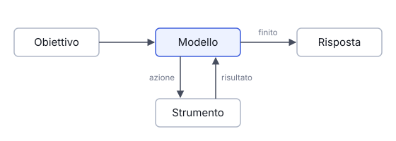

# IT

## In una frase

Un agente è un modello linguistico che, in un ciclo, sceglie azioni, usa strumenti e guarda i risultati finché raggiunge un obiettivo.

## Approfondimento

Un chatbot risponde una volta e si ferma. Un **agente** riceve un obiettivo e lavora in più passi. A ogni passo il modello legge la situazione, decide cosa fare, chiama uno strumento (una ricerca, un file, un programma) e legge il risultato. Poi sceglie il passo successivo. Il modello in sé produce solo testo: è il programma intorno, spesso chiamato harness, che esegue le azioni e gli restituisce l'esito.

Il vantaggio è che l'agente può affrontare compiti aperti, dove i passi non sono noti in anticipo, e può correggersi quando un tentativo fallisce. Il prezzo è il controllo. Più passi significano più costi, più tempo e più occasioni di errore, e un errore iniziale si propaga. Per questo un buon agente ha confini chiari: quali strumenti può usare, quando fermarsi e quali azioni richiedono l'approvazione di una persona.

## Nella vita di tutti i giorni

Un amico va a fare la spesa per te con una lista e il telefono in mano. Al supermercato il basilico è finito. Non torna a casa a mani vuote: si guarda intorno, ti scrive «prendo il prezzemolo?», aspetta la risposta e continua. Alla cassa ricontrolla la lista prima di pagare. Ecco un agente: un obiettivo, degli strumenti, decisioni passo dopo passo e un controllo alla fine.

## Errore comune

Si pensa che un agente sia un modello più intelligente. Spesso è lo stesso modello di una normale chat, messo in un ciclo con strumenti e regole. La differenza la fa il sistema intorno, non solo il modello.

## Didascalia della figura

Il modello sceglie un'azione, lo strumento la esegue e il risultato torna al modello, finché il compito è finito.

# EN

## One line

An agent is a language model that, in a loop, picks actions, uses tools and checks the results until it reaches a goal.

## Deep dive

A chatbot answers once and stops. An **agent** gets a goal and works in several steps. At each step the model reads the situation, decides what to do, calls a tool (a search, a file, a program) and reads the result. Then it picks the next step. The model itself only produces text: the program around it, often called the harness, runs the actions and feeds back the outcome.

The benefit is that an agent can handle open-ended tasks, where the steps are not known in advance, and it can correct itself when an attempt fails. The cost is control. More steps mean more money, more time and more chances to go wrong, and an early mistake carries forward. So a good agent has clear limits: which tools it may use, when to stop, and which actions need a person's approval.

## In everyday life

A friend goes grocery shopping for you with a list and a phone. The shop is out of basil. They do not come home empty-handed: they look around, text you 'parsley instead?', wait for the reply and carry on. At the till they check the list again before paying. That is an agent: a goal, some tools, step-by-step decisions and a check at the end.

## Common mistake

People think an agent is a smarter model. Often it is the same model you chat with, placed in a loop with tools and rules. The system around it makes the difference, not just the model.

## Figure caption

The model picks an action, the tool runs it and the result goes back to the model, until the task is done.
