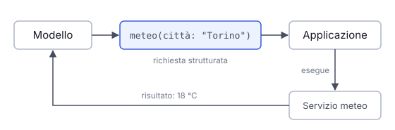

# IT

## In una frase

Con il tool calling il modello non esegue nulla: scrive una richiesta strutturata, il programma la esegue e gli restituisce il risultato.

## Approfondimento

Lo sviluppatore descrive al modello gli strumenti disponibili: un nome, a cosa serve e quali parametri accetta, di solito con uno schema JSON, cioè un formato che elenca campi e tipi. Quando il modello ritiene utile uno strumento, invece di rispondere in prosa produce un messaggio strutturato, per esempio «meteo, città: Torino». Il programma riconosce la richiesta, chiama davvero il servizio e inserisce il risultato nella conversazione. Il modello lo legge e prosegue.

Questo collega il modello al mondo reale: dati aggiornati, calcoli esatti, azioni su altri sistemi. La qualità dipende molto dalle descrizioni. Un nome vago o un parametro ambiguo portano a chiamate sbagliate. Il modello può anche inventare valori o scegliere lo strumento sbagliato, quindi il programma deve validare gli argomenti e limitare cosa ogni strumento può fare. Troppi strumenti insieme confondono il modello e occupano spazio nel contesto.

## Esempio for dummies

Al ristorante il cameriere non cucina. Prende l'ordinazione, la scrive su un foglietto in un formato preciso (tavolo 4, due carbonare, una senza pepe) e la passa in cucina. Quando il piatto è pronto, lo porta al tavolo. Il modello è il cameriere: scrive l'ordine nel formato giusto. La cucina è il programma che esegue davvero. Se il foglietto è scritto male, arriva il piatto sbagliato.

## Errore comune

Si crede che il modello «vada su internet» o «esegua codice» da solo. Il modello scrive solo la richiesta. È l'applicazione a eseguirla, con i permessi che le sono stati dati. La sicurezza si decide lì.

## Didascalia della figura

Il modello scrive solo una richiesta strutturata: l'applicazione la esegue sul servizio e gli restituisce il risultato.

# EN

## One line

With tool calling the model runs nothing itself: it writes a structured request, the program executes it and hands back the result.

## Deep dive

The developer describes the available tools to the model: a name, what it does and which parameters it takes, usually as a JSON schema, a format that lists fields and their types. When the model decides a tool would help, it does not answer in prose. It emits a structured message, such as 'weather, city: Turin'. The program spots the request, actually calls the service and puts the result back into the conversation. The model reads it and carries on.

This connects the model to the real world: fresh data, exact calculations, actions on other systems. Quality depends heavily on the descriptions. A vague name or an ambiguous parameter leads to wrong calls. The model can also invent values or pick the wrong tool, so the program must validate arguments and limit what each tool can do. Too many tools at once confuse the model and take up room in the context.

## For dummies

In a restaurant the waiter does not cook. They take the order, write it on a slip in a fixed format (table 4, two carbonara, one without pepper) and pass it to the kitchen. When the dish is ready, they bring it out. The model is the waiter: it writes the order in the right format. The kitchen is the program that does the real work. A badly written slip means the wrong dish.

## Common mistake

People think the model 'goes online' or 'runs code' by itself. The model only writes the request. The application executes it, with whatever permissions it was given. That is where safety is decided.

## Figure caption

The model only writes a structured request: the application runs it against the service and returns the result.
