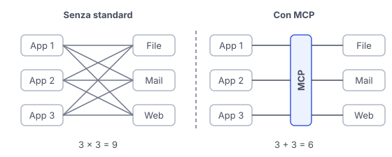

# IT

## In una frase

MCP è uno standard aperto che permette a un'applicazione AI di collegarsi a strumenti e dati esterni con un'interfaccia comune.

## Approfondimento

Senza uno standard, ogni applicazione AI deve scrivere un connettore su misura per ogni servizio: calendario, archivio di file, database. Con N applicazioni e M servizi servono N per M integrazioni. Il **Model Context Protocol**, introdotto da Anthropic nel 2024 come standard aperto, riduce il problema: ogni servizio si scrive una volta come server MCP e ogni applicazione compatibile lo può usare.

I ruoli sono tre. L'host è l'applicazione con cui lavori. Al suo interno, un client mantiene la connessione con un server. Il server espone tre tipi di cose: strumenti (azioni che il modello può chiedere), risorse (dati da leggere, come file o documenti) e prompt (modelli di istruzioni pronti all'uso).

MCP standardizza il collegamento, non la fiducia. Un server di terzi può essere scritto male o essere malevolo, e ogni server collegato aggiunge descrizioni al contesto. Con molti server conviene caricare gli strumenti solo quando servono.

## Esempio for dummies

Prima dell'USB-C ogni telefono aveva il suo caricatore e i cassetti erano pieni di cavi. Poi è arrivata una porta comune: lo stesso cavo carica il telefono, il portatile e le cuffie. MCP fa lo stesso per l'AI. Chi costruisce un servizio crea una sola «porta» MCP e ogni app AI compatibile sa già come collegarsi. Come per i caricatori, però, una porta standard non garantisce che il cavo sia di buona qualità.

## Errore comune

Si pensa che MCP sia un modello o un'alternativa al tool calling. È un protocollo di collegamento: definisce come un'app scopre e chiama strumenti esterni. Sotto, il modello usa comunque il tool calling.

## Didascalia della figura

Senza uno standard ogni app serve un connettore per ogni servizio, mentre con MCP ognuno si collega una volta sola all'interfaccia comune.

# EN

## One line

MCP is an open standard that lets an AI application connect to external tools and data through one common interface.

## Deep dive

Without a standard, every AI application needs a custom connector for every service: calendar, file store, database. With N apps and M services you need N times M integrations. The **Model Context Protocol**, introduced by Anthropic in 2024 as an open standard, shrinks the problem: each service is written once as an MCP server, and any compatible application can use it.

There are three roles. The host is the application you work in. Inside it, a client holds the connection to one server. The server exposes three kinds of things: tools (actions the model can request), resources (data to read, such as files or documents) and prompts (ready-made instruction templates).

MCP standardizes the connection, not the trust. A third-party server can be badly written or malicious, and every connected server adds descriptions to the context. With many servers, it pays to load tools only when they are needed.

## For dummies

Before USB-C, every phone had its own charger and drawers filled up with cables. Then a common port arrived: the same cable charges the phone, the laptop and the headphones. MCP does the same for AI. Whoever builds a service makes one MCP 'port', and every compatible AI app already knows how to plug in. As with chargers, though, a standard port does not guarantee a good cable.

## Common mistake

People think MCP is a model, or a replacement for tool calling. It is a connection protocol: it defines how an app discovers and calls external tools. Underneath, the model still uses tool calling.

## Figure caption

Without a standard, each app needs a connector for each service, while with MCP, each side connects once to the common interface.
