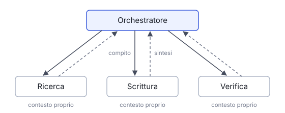

# IT

## In una frase

Un sistema multi-agente divide un compito tra più agenti, ognuno con ruolo, strumenti e contesto propri, coordinati tra loro.

## Approfondimento

Lo schema più comune ha un orchestratore, cioè un agente coordinatore, che scompone il compito e assegna le parti a sotto-agenti. Ognuno lavora con un contesto pulito e solo gli strumenti che gli servono, poi restituisce un risultato sintetico. Altri schemi sono la catena, dove l'output di uno è l'input del successivo, e la revisione, dove un agente produce e un altro controlla.

I vantaggi sono reali: lavori indipendenti in parallelo, contesti più corti e quindi più focalizzati, ruoli più facili da testare. Ma ogni **passaggio** tra agenti perde informazioni, come nel gioco del telefono senza fili. I costi in token si moltiplicano e gli errori diventano più difficili da rintracciare. Regola pratica: usare più agenti solo quando il lavoro si divide davvero in parti indipendenti. Per un compito lineare di solito basta un solo agente ben istruito.

## Esempio for dummies

Trasloco di famiglia. Una persona coordina: qualcuno smonta i mobili, qualcuno imballa i libri, qualcuno carica il furgone. Ognuno sa solo quello che serve per il suo pezzo. Alla fine chi coordina controlla che non manchi nulla. Funziona perché i compiti sono separati. Se tre persone imballassero la stessa libreria, si intralcerebbero e nessuno saprebbe più in quale scatola sono finiti i libri.

## Errore comune

Si pensa che più agenti diano sempre risultati migliori, come una squadra più grande. Spesso succede il contrario: più passaggi, più costi, più errori di comunicazione. Conviene solo quando il lavoro si divide bene.

## Didascalia della figura

L'orchestratore assegna un compito a ogni sotto-agente, che lavora nel proprio contesto e restituisce solo una sintesi.

# EN

## One line

A multi-agent system splits a task across several agents, each with its own role, tools and context, working in coordination.

## Deep dive

The most common pattern has an orchestrator, a coordinating agent that breaks the task down and hands the parts to sub-agents. Each one works with a clean context and only the tools it needs, then returns a short result. Other patterns are the pipeline, where one agent's output is the next one's input, and review, where one agent produces and another checks.

The gains are real: independent work runs in parallel, contexts stay shorter and more focused, and roles are easier to test. But every **hand-off** between agents loses information, like a game of telephone. Token costs multiply and errors get harder to trace. A practical rule: use several agents only when the work truly splits into independent parts. For a linear task, one well-instructed agent is usually enough.

## For dummies

A family house move. One person coordinates: someone takes the furniture apart, someone packs the books, someone loads the van. Each knows only what their part requires. At the end the coordinator checks that nothing is missing. It works because the jobs are separate. If three people packed the same bookcase, they would get in each other's way and nobody would know which box the books went into.

## Common mistake

People assume more agents always means better results, like a bigger team. Often it is the reverse: more hand-offs, more cost, more miscommunication. It only pays off when the work splits cleanly.

## Figure caption

The orchestrator gives each sub-agent a task, and each works in its own context and returns only a summary.
