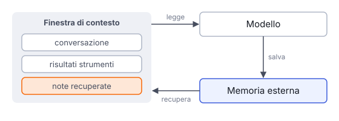

# IT

## In una frase

Il modello non ricorda nulla tra una chiamata e l'altra: la memoria di un agente è testo che il sistema salva e rimette nel contesto.

## Approfondimento

I pesi del modello non cambiano mentre lo usi. A ogni chiamata il modello vede solo ciò che sta nella finestra di contesto. La **memoria a breve termine** è quindi la conversazione stessa, con i risultati degli strumenti. Quando diventa troppo lunga, il sistema la riassume o taglia le parti più vecchie.

La memoria a lungo termine vive fuori dal modello: file di note, database, archivi cercati per significato con gli embedding. L'agente scrive lì fatti utili (preferenze, decisioni, lavoro in sospeso) e il sistema recupera i pezzi pertinenti all'inizio di un nuovo compito.

Il difficile è scegliere. Salvare tutto riempie il contesto di rumore. Salvare male fissa errori che poi vengono riletti come veri. Una memoria utile è breve, datata, rivista ogni tanto e trattata come un appunto da verificare, non come una verità.

## Esempio for dummies

Un'infermiera finisce il turno di notte. Non può passare la propria testa alla collega del mattino, quindi lascia una consegna scritta: chi ha la febbre, quali farmaci sono stati dati, cosa controllare alle dieci. La collega legge e riparte da lì. Se la consegna è troppo lunga, l'essenziale si perde. Se contiene un errore, l'errore passa al turno successivo.

## Errore comune

Si pensa che l'agente «impari» da ogni conversazione come una persona. Il modello resta identico. Ricorda solo ciò che il sistema ha salvato e gli rimette davanti; il resto è perso.

## Didascalia della figura

Il modello legge solo la finestra di contesto; la memoria a lungo termine sta fuori, e il sistema salva e recupera note.

# EN

## One line

The model remembers nothing between calls: an agent's memory is text that the system saves and puts back into the context.

## Deep dive

The model's weights do not change while you use it. On each call the model sees only what is in its context window. So **short-term memory** is the conversation itself, plus tool results. When it gets too long, the system summarizes it or drops the older parts.

Long-term memory lives outside the model: note files, databases, stores searched by meaning with embeddings. The agent writes useful facts there (preferences, decisions, unfinished work), and the system retrieves the relevant pieces at the start of a new task.

The hard part is choosing. Saving everything fills the context with noise. Saving badly locks in mistakes that are later read back as true. Useful memory is short, dated, reviewed now and then, and treated as a note to verify, not as the truth.

## For dummies

A nurse finishes the night shift. She cannot hand her memory to the morning colleague, so she leaves a written handover: who has a fever, which drugs were given, what to check at ten. The colleague reads it and picks up from there. If the note is too long, the essentials get lost. If it contains a mistake, the mistake carries into the next shift.

## Common mistake

People think an agent 'learns' from every conversation the way a person does. The model stays the same. It only remembers what the system saved and shows it again; the rest is gone.

## Figure caption

The model reads only the context window; long-term memory sits outside, and the system saves and retrieves notes.
