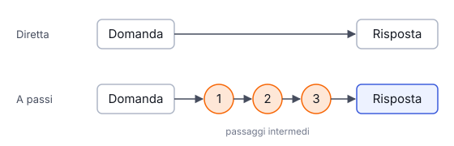

# IT

## In una frase

Un agente pianifica scrivendo i passi prima di agire e ragiona producendo passaggi intermedi: due abitudini che lo aiutano nei compiti lunghi.

## Approfondimento

Un modello genera un token alla volta. Se deve arrivare subito alla risposta, ha poco spazio per i calcoli intermedi. Quando invece scrive prima i passaggi (il cosiddetto **chain of thought**, catena di ragionamento), ogni passo diventa contesto per il successivo. Molti modelli oggi lo fanno in una fase di ragionamento dedicata, prima della risposta finale.

Nella pianificazione l'agente scompone l'obiettivo in sotto-compiti, li ordina e spesso li scrive in una lista da spuntare. Il piano non è fisso: dopo ogni azione il risultato può mostrare che serve cambiare strada. Uno schema noto, ReAct, alterna pensiero, azione e osservazione.

Il limite: più ragionamento costa più token e più tempo, e aggiunge poco alle domande semplici. Inoltre il testo del ragionamento non è sempre una descrizione fedele di come il modello è arrivato alla risposta.

## Nella vita di tutti i giorni

Per una cena con otto ospiti nessuno inizia a cucinare a caso. Prima si scrive il menu, poi la lista della spesa, poi l'ordine: il dolce la mattina perché deve raffreddare, l'arrosto alle sei, l'insalata per ultima. Se al mercato mancano i carciofi, si cambia contorno e si aggiorna il piano. Scrivere i passi non rende il cuoco più bravo, ma gli evita di perdere il filo.

## Errore comune

Si pensa che il ragionamento scritto mostri esattamente cosa «pensa» il modello. È un testo utile che migliora il risultato, ma non è una registrazione fedele del calcolo interno. Va letto con prudenza.

## Didascalia della figura

Rispondere subito lascia poco spazio al calcolo, mentre scrivere passaggi intermedi dà a ogni passo il contesto del precedente.

# EN

## One line

An agent plans by writing down steps before acting, and reasons by producing intermediate steps: two habits that help on long tasks.

## Deep dive

A model generates one token at a time. If it must jump straight to the answer, it has little room for intermediate work. When it first writes out the steps (so-called **chain of thought**), each step becomes context for the next. Many models now do this in a dedicated reasoning phase before the final answer.

In planning, the agent breaks the goal into sub-tasks, orders them and often writes them as a checklist. The plan is not fixed: after each action, the result may show that a change of route is needed. A well-known pattern, ReAct, alternates thought, action and observation.

The limit: more reasoning costs more tokens and more time, and adds little to simple questions. Also, the written reasoning is not always a faithful account of how the model actually reached its answer.

## In everyday life

Nobody cooks dinner for eight by starting at random. First the menu, then the shopping list, then the order: dessert in the morning because it must cool, the roast at six, the salad last. If the market has no artichokes, the side dish changes and the plan is updated. Writing the steps down does not make the cook more skilled, but it keeps them from losing track.

## Common mistake

People think the written reasoning shows exactly what the model 'thinks'. It is useful text that improves the result, but not a faithful record of the internal computation. Read it with care.

## Figure caption

Answering at once leaves little room for working, while writing intermediate steps gives each step the previous one as context.
