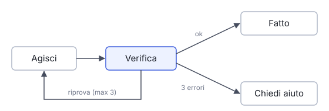

# IT

## In una frase

Il ciclo è il motore dell'agente: agisci, osserva, decidi se continuare. Funziona bene solo con una verifica chiara e un limite di tentativi.

## Approfondimento

Il ciclo base è semplice. Il modello riceve il contesto, sceglie un'azione, il programma la esegue e aggiunge il risultato al contesto. Si ripete finché il modello dichiara di aver finito o scatta un limite. Ogni giro allunga il contesto, quindi costi e tempi crescono a ogni passo.

La domanda chiave è: come sa l'agente di aver finito? Il modo più affidabile è definire prima la **verifica**: un test che passa, un file che esiste, una lista di criteri controllabili. Senza una verifica esterna l'agente tende a dichiarare successo troppo presto, oppure a girare in tondo ripetendo lo stesso tentativo.

Servono anche dei freni. Un numero massimo di giri e di tentativi per lo stesso errore. E un controllo umano prima delle azioni difficili da annullare, come cancellare dati o inviare messaggi: più grande è il danno possibile, più forte deve essere il cancello.

## Esempio for dummies

Un ragazzo impara a fare il pane con un termometro da cucina. Inforna, aspetta, misura: se il cuore della pagnotta non è abbastanza caldo, la rimette in forno per cinque minuti. Ripete finché il termometro dice sì. Ma la nonna gli ha dato una regola: dopo tre tentativi andati male si ferma e la chiama, invece di bruciare la cena. La verifica decide quando ha finito, il limite decide quando chiedere aiuto.

## Errore comune

Si pensa che basti lasciare girare l'agente più a lungo per avere un risultato migliore. Senza una verifica esterna, più giri spesso significano solo più costi e lo stesso errore ripetuto.

## Didascalia della figura

Dopo ogni azione una verifica decide: se passa il lavoro è finito, se fallisce si riprova fino a un limite, poi si chiede a una persona.

# EN

## One line

The loop is the agent's engine: act, observe, decide whether to continue. It works well only with a clear check and a cap on attempts.

## Deep dive

The basic loop is simple. The model receives the context, picks an action, the program runs it and adds the result to the context. This repeats until the model says it is done or a limit kicks in. Each turn makes the context longer, so cost and time grow with every step.

The key question is: how does the agent know it is done? The most reliable way is to define the **check** first: a test that passes, a file that exists, a list of criteria that can be verified. Without an external check, the agent tends to declare success too early, or to go round in circles retrying the same thing.

It also needs brakes. A maximum number of turns, and of retries for the same error. And a human check before actions that are hard to undo, such as deleting data or sending messages: the bigger the possible damage, the stronger the gate should be.

## For dummies

A teenager learns to bake bread with a kitchen thermometer. Bake, wait, measure: if the middle of the loaf is not hot enough, back in the oven for five minutes. Repeat until the thermometer says yes. But grandma set a rule: after three failed tries, stop and call her rather than burn dinner. The check decides when the job is done. The cap decides when to ask for help.

## Common mistake

People think letting an agent run longer gives a better result. Without an external check, more turns often just mean more cost and the same mistake repeated.

## Figure caption

After each action a check decides: if it passes the job is done, if it fails the agent retries up to a cap, then asks a person.
