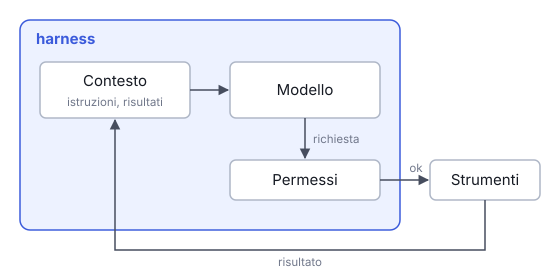

# IT

## In una frase

L'harness è il programma intorno al modello: decide cosa il modello vede, esegue le azioni che chiede e stabilisce cosa gli è permesso.

## Approfondimento

Il modello produce solo testo. Tutto il resto lo fa l'**harness**: prepara il contesto, chiama il modello, legge la sua richiesta, esegue lo strumento e gli restituisce il risultato. L'harness gestisce il ciclo e l'accesso agli strumenti delle lezioni precedenti. Per questo lo stesso modello, in due harness diversi, può comportarsi come due prodotti diversi.

Il secondo compito è scegliere cosa il modello vede a ogni passo: istruzioni di sistema, istruzioni del progetto lette a ogni sessione (per esempio un file AGENTS.md), procedure caricate solo quando servono. Quando la finestra di contesto si riempie, molti harness la **compattano** (compaction): sostituiscono la parte più vecchia con una versione ridotta, spesso un riassunto. Si libera spazio, ma qualche dettaglio può perdersi.

Il terzo compito è applicare i limiti. «Non cancellare file» scritto nel prompt è solo testo, e il modello può non rispettarlo. Un permesso negato dall'harness invece blocca davvero l'azione, e una sandbox limita l'accesso dei programmi eseguiti al suo interno, per esempio a file e rete. Non tutti gli harness offrono questi meccanismi.

## Nella vita di tutti i giorni

Lo stesso cuoco può lavorare in due cucine. Nella prima trova il banco già preparato, il ricettario del locale aperto alla pagina giusta e un aiuto che gli passa gli attrezzi. Il forno a legna però lo accende solo il titolare. Nella seconda ha un fornello e una dispensa in disordine. Il talento è lo stesso, i piatti no. La cucina decide cosa ha sotto mano e cosa resta chiuso.

## Errore comune

Si pensa che la qualità di un assistente dipenda solo dal modello. Con un harness diverso lo stesso modello vede un contesto diverso, ha strumenti e permessi diversi, e può dare risultati molto diversi.

## Didascalia della figura

L'harness avvolge il modello: prepara il contesto, controlla i permessi prima di ogni azione e riporta il risultato degli strumenti nel contesto.

# EN

## One line

The harness is the program around the model: it chooses what the model sees, runs the actions it requests and sets what it may do.

## Deep dive

The model only produces text. The **harness** does everything else: it prepares the context, calls the model, reads its request, runs the tool and feeds back the result. The harness manages the loop and access to the tools described in earlier lessons. That is why the same model, in two different harnesses, can behave like two different products.

Its second job is choosing what the model sees at each step: system instructions, project instructions read at every session (for example an AGENTS.md file), procedures loaded only when needed. When the context window fills up, many harnesses **compact** it (compaction): they replace the oldest part with a shorter version, often a summary. This frees space, but some details can get lost.

Its third job is enforcing limits. "Do not delete files" written in the prompt is only text, and the model may not follow it. A permission denied by the harness actually blocks the action, and a sandbox restricts what programs running inside it can access, such as files and the network. Not every harness offers these mechanisms.

## In everyday life

The same cook can work in two kitchens. In the first, the counter is already prepped, the house recipe book is open at the right page and an assistant hands over the tools. Only the owner lights the wood oven, though. In the second there is one burner and a messy pantry. Same talent, different dishes. The kitchen decides what is within reach and what stays locked.

## Common mistake

People think an assistant's quality depends only on the model. With a different harness, the same model sees a different context, has different tools and permissions, and can give very different results.

## Figure caption

The harness wraps the model: it prepares the context, checks permissions before each action and brings the tools' results back into the context.
