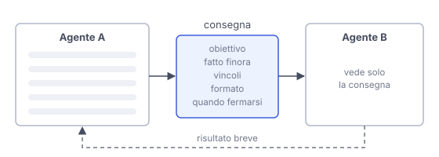

# IT

## In una frase

Delegare significa passare un compito a un altro agente o a una persona, e la qualità dipende da cosa viene scritto nel passaggio.

## Approfondimento

Ci sono due forme principali. Nella delega l'agente principale affida un sotto-compito a un altro agente e aspetta il risultato, restando responsabile. Nell'**handoff** il controllo passa del tutto: per esempio un assistente generico trasferisce la conversazione a un agente specializzato, o a un operatore umano.

Quanto contesto passa dipende dal sistema. Nella delega chi riceve può non vedere la conversazione precedente e lavorare dall'incarico e dalle proprie istruzioni. Nell'handoff spesso riceve anche la conversazione, ma non sempre. In ogni caso chi riceve deve avere le informazioni necessarie: l'obiettivo, cosa è già stato fatto, i vincoli, il formato della risposta e quando fermarsi. Un incarico vago produce lavoro vago o duplicato.

Nella delega conta anche il ritorno. Il risultato deve essere breve e verificabile, non un lungo racconto che riempie il contesto di chi ha delegato. E chi delega deve controllarlo: affidare un compito non significa affidare la responsabilità.

## Nella vita di tutti i giorni

Prima delle vacanze lasci le chiavi alla vicina perché bagni le piante. Se le dici solo «pensaci tu», al ritorno trovi il basilico annegato e il cactus marcito. Se le lasci un biglietto (quali piante, quanta acqua, ogni quanti giorni, cosa fare se una ingiallisce), è tutto in ordine. La vicina è brava in entrambi i casi: cambia solo il biglietto.

## Errore comune

Si pensa che l'agente che riceve il compito «sappia già» di cosa si parla. Spesso non vede la conversazione precedente, o ne vede solo una parte. La consegna deve aggiungere ciò che manca nel contesto ricevuto.

## Didascalia della figura

In questo esempio di delega, B riceve da A solo la consegna scritta e restituisce un risultato breve.

# EN

## One line

Delegating means passing a task to another agent or to a person, and the quality depends on what gets written in the hand-off.

## Deep dive

There are two main forms. In delegation, the main agent gives a sub-task to another agent and waits for the result, staying responsible. In a **handoff**, control moves over entirely: for example, a general assistant passes the conversation to a specialized agent, or to a human operator.

How much context travels depends on the system. With delegation, the receiver may not see the previous conversation and instead work from the brief and its own instructions. With a handoff it often gets the conversation too, but not always. Either way, the receiver needs the relevant information: the goal, what has been done, the constraints, the expected format and when to stop. A vague brief produces vague or duplicated work.

In delegation, the return trip matters too. The result should be short and checkable, not a long story that clogs the delegator's context. And the delegator must check it: handing off a task does not hand off responsibility.

## In everyday life

Before your holiday you leave your keys with the neighbour so she can water the plants. Say only 'you'll manage' and you come back to drowned basil and a rotten cactus. Leave a note (which plants, how much water, how often, what to do if one turns yellow) and everything is fine. The neighbour is just as capable either way. Only the note changed.

## Common mistake

People think the receiving agent 'already knows' what the task is about. Often it cannot see the earlier conversation, or sees only part of it. The brief must supply what is missing from the context received.

## Figure caption

In this delegation example, B receives only the written brief from A and returns a short result.
