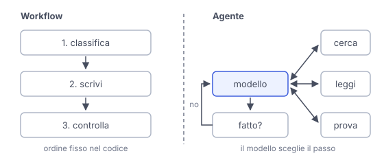

# IT

## In una frase

In un workflow i passi li fissa il programmatore, in un agente li sceglie il modello strada facendo: conviene partire dal più semplice.

## Approfondimento

In un **workflow** il programmatore fissa i passi nel codice. Per esempio: il modello classifica un messaggio arrivato a una scuola, un secondo passaggio scrive la risposta adatta a quella categoria, un controllo finale verifica il tono. Il modello può scegliere tra percorsi già previsti dal codice, ma non pianifica liberamente i passi. In un agente invece è il modello a decidere a ogni giro cosa fare, quale strumento usare e quando fermarsi.

Il workflow è prevedibile: costa più o meno sempre uguale, si prova facilmente e, quando sbaglia, si vede in quale passo. Va bene quando i passi sono noti in anticipo. L'agente serve quando non si sa prima quali e quanti passi serviranno, come una ricerca aperta o la correzione di un errore in un programma.

Il compromesso è tra flessibilità e controllo. Un agente spende più tempo e denaro, e un errore iniziale può portarlo fuori strada. Il consiglio pratico è partire dalla soluzione più semplice: una sola chiamata ben scritta, poi un workflow, e un agente solo se serve davvero.

## Nella vita di tutti i giorni

Una ricetta di torta è un workflow: pesare, mescolare, infornare per trenta minuti, sempre in quest'ordine. Funziona ogni volta e, se la torta viene male, sai a quale passo guardare. Un cuoco a cui dici "prepara una cena con quello che trovi in frigo" è un agente: apre, guarda, decide, cambia idea. Gli serve più tempo e il risultato è meno prevedibile. Per una torta non serve chiamarlo.

## Errore comune

Pensare che un agente sia sempre la scelta più avanzata, e quindi la migliore. Per molti compiti un workflow fa lo stesso lavoro con meno costi e meno sorprese. L'agente conviene quando i passi non si possono prevedere.

## Didascalia della figura

A sinistra i passi sono fissati nel codice, a destra il modello sceglie a ogni giro il passo successivo e quando fermarsi.

# EN

## One line

In a workflow the programmer sets the steps, in an agent the model picks them as it goes: start with the simpler one.

## Deep dive

In a **workflow** the programmer fixes the steps in code. For example: the model sorts a message sent to a school, a second step writes a reply for that category, and a final check reviews the tone. The model may choose between routes already laid out in code, but it does not freely plan the steps. In an agent the model decides on each turn what to do, which tool to use and when to stop.

A workflow is predictable: it costs roughly the same every time, is easy to test and, when it fails, you can see at which step. It suits tasks whose steps are known in advance. An agent is for cases where you cannot know beforehand which steps, or how many, are needed, such as an open-ended search or fixing a bug.

The trade-off is flexibility against control. An agent spends more time and money, and an early mistake can send it off course. The practical advice: start with the simplest solution: one well-written call, then a workflow, and an agent only when truly needed.

## In everyday life

A cake recipe is a workflow: weigh, mix, bake for thirty minutes, always in that order. It works every time and, if the cake goes wrong, you know which step to look at. A cook told "make dinner from whatever is in the fridge" is an agent: they open it, look, decide, change their mind. It takes longer and the result is less predictable. For a cake, you do not need to call them.

## Common mistake

Thinking an agent is always the more advanced choice, and therefore the better one. For many tasks a workflow does the same job with lower costs and fewer surprises. An agent pays off when the steps cannot be predicted.

## Figure caption

On the left the steps are fixed in code, on the right the model picks the next step on each turn and decides when to stop.
