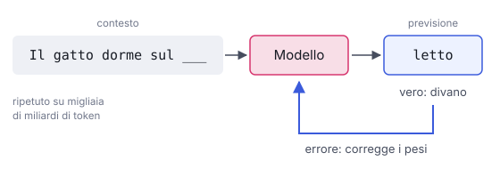

# IT

## In una frase

Il pre-training è la prima fase: il modello legge enormi quantità di testo e impara a prevedere il token successivo.

## Approfondimento

Nel pre-training il modello parte da pesi casuali. Riceve miliardi di frasi prese da libri, siti web e codice. Per ogni pezzo di testo deve indovinare il **token** successivo, cioè la parola o il frammento di parola che viene dopo. Se sbaglia, un algoritmo corregge di poco i suoi pesi. Ripetuto su migliaia di miliardi di token, questo esercizio semplice costringe il modello a imparare grammatica, fatti, stili e schemi di ragionamento.

Non servono etichette scritte da persone: la risposta giusta è già nel testo. Per questo si parla di apprendimento auto-supervisionato. È ciò che permette di usare così tanti dati.

Il prezzo è alto. Servono migliaia di processori grafici (GPU) per settimane o mesi. Il risultato è un modello base: sa continuare un testo, ma non è ancora un assistente che segue istruzioni. Conosce il mondo solo fino alla data in cui sono stati raccolti i dati, e ne eredita errori e pregiudizi.

## Esempio for dummies

Un bambino passa anni ad ascoltare le persone intorno a sé. Nessuno gli spiega la grammatica, eppure a un certo punto sa che dopo "buona" viene spesso "notte" o "giornata". Ha assorbito le regole sentendo frasi su frasi. Il pre-training funziona così, su scala enorme: tanta esposizione, nessuna lezione esplicita. Il bambino però non sa ancora come comportarsi a un colloquio di lavoro. Quello si impara dopo.

## Errore comune

Si pensa che il modello memorizzi Internet come un archivio da consultare. Salvo alcuni passaggi molto ripetuti, non conserva i documenti: comprime regolarità statistiche nei pesi. Per questo ricorda bene i fatti noti ma può ricostruire male i dettagli rari.

## Didascalia della figura

Il modello vede un testo, prova a indovinare il token successivo e corregge i pesi in base all'errore.

# EN

## One line

Pre-training is the first phase: the model reads huge amounts of text and learns to predict the next token.

## Deep dive

Pre-training starts from random weights. The model is fed billions of sentences from books, websites and code. For each stretch of text it must guess the next **token**, a word or a piece of a word. When it guesses wrong, an algorithm nudges its weights slightly. Repeated over trillions of tokens, this simple game forces the model to pick up grammar, facts, styles and patterns of reasoning.

No human labels are needed: the right answer is already in the text. This is called self-supervised learning, and it is what makes such huge datasets usable.

The cost is high: thousands of GPUs running for weeks or months. The result is a base model. It can continue text, but it is not yet an assistant that follows instructions. It knows the world only up to the date its data was collected, and it inherits that data's errors and biases.

## For dummies

A toddler spends years listening to the people around them. Nobody teaches them grammar, yet one day they know that "good" is often followed by "night" or "morning". They absorbed the rules just by hearing sentence after sentence. Pre-training works the same way at enormous scale: massive exposure, no explicit lessons. The toddler still has no idea how to behave in a job interview, though. That comes later.

## Common mistake

People think the model stores the internet like an archive it can look things up in. Apart from some heavily repeated passages, it doesn't keep the documents: it compresses statistical patterns into its weights. So it recalls well-known facts but can get rare details wrong.

## Figure caption

The model sees some text, guesses the next token and adjusts its weights based on the error.
