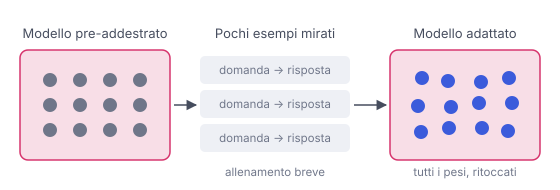

# IT

## In una frase

Il fine-tuning riprende un modello già addestrato e continua ad allenarlo su pochi esempi mirati, per adattarlo a un compito o a uno stile.

## Approfondimento

Il **fine-tuning** (letteralmente "regolazione fine") usa lo stesso meccanismo del pre-training, ma su dati diversi. Invece di miliardi di pagine generiche, il modello vede un insieme scelto con cura, da qualche centinaio a decine di migliaia di esempi: domande con risposta, testi nel tono giusto, documenti nel formato voluto. I pesi cambiano poco, ma abbastanza da spostare il comportamento.

Funziona bene per insegnare uno stile, un formato fisso, un gergo o un compito ripetitivo, come smistare messaggi. Costa molto meno del pre-training, perché il modello conosce già la lingua e il mondo.

Ha due limiti noti. Primo: è poco affidabile per aggiungere fatti nuovi o che cambiano spesso. In quel caso conviene recuperare i documenti al momento della domanda. Secondo: se si esagera, il modello può perdere capacità che aveva prima. Questo fenomeno si chiama oblio catastrofico.

## Esempio for dummies

Una cuoca esperta viene assunta in un ristorante giapponese. Sa già tagliare, cuocere e condire: non deve tornare a scuola. Passa un mese accanto allo chef per imparare il riso da sushi, i tagli del pesce e l'impiattamento della casa. Alla fine cucina in stile giapponese senza aver dimenticato il resto. Se però per un anno facesse solo sushi, qualche ricetta di prima potrebbe arrugginirsi.

## Errore comune

L'errore più comune è credere che il fine-tuning sia il modo migliore per far "sapere" al modello i propri documenti. Cambia soprattutto il comportamento. Per fatti aggiornati ed esatti funziona meglio recuperare i testi giusti e metterli nel prompt.

## Didascalia della figura

Pochi esempi mirati ritoccano i pesi di un modello già addestrato.

# EN

## One line

Fine-tuning takes an already trained model and keeps training it on a small, targeted set of examples to adapt it to a task or style.

## Deep dive

**Fine-tuning** uses the same mechanism as pre-training, but on different data. Instead of billions of generic pages, the model sees a curated set, from a few hundred to tens of thousands of examples: questions with answers, texts in the right tone, documents in the target format. The weights move only a little, but enough to shift behaviour.

It works well for teaching a style, a fixed output format, a vocabulary or a repetitive task such as sorting messages. It costs far less than pre-training because the model already knows the language and the world.

It has two known limits. First, it is an unreliable way to add new or fast-changing facts. Fetching the documents at question time usually works better. Second, push it too hard and the model can lose skills it had before. This is called catastrophic forgetting.

## For dummies

An experienced cook joins a Japanese restaurant. She already knows how to chop, cook and season, so there's no going back to school. She spends a month beside the chef learning sushi rice, fish cuts and the house plating. Afterwards she cooks Japanese-style without forgetting everything else. If she made nothing but sushi for a year, though, some of her old recipes might get rusty.

## Common mistake

The most common error is thinking fine-tuning is the best way to make a model "know" your documents. It mostly changes behaviour. For facts that must be current and exact, retrieving the right texts and placing them in the prompt works better.

## Figure caption

A few targeted examples nudge the weights of an already trained model.
