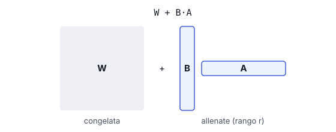

# IT

## In una frase

LoRA adatta un modello allenando solo piccole matrici aggiuntive, e QLoRA fa lo stesso tenendo il modello base compresso a 4 bit.

## Approfondimento

Il fine-tuning completo aggiorna tutti i pesi del modello: miliardi di numeri e molta memoria. **LoRA** (Low-Rank Adaptation, 2021) congela il modello originale. Accanto ad alcune matrici di pesi aggiunge due matrici piccole e strette, il cui prodotto rappresenta la correzione da applicare. Si allenano solo queste, spesso meno dell'1% dei parametri.

Il risultato è un adattatore leggero, un file da pochi a qualche centinaio di megabyte. Si possono tenere molti adattatori per compiti diversi e cambiarli sopra lo stesso modello base. QLoRA (2023) aggiunge un passo: carica il modello base quantizzato a 4 bit (vedi Quantization) e allena gli adattatori a precisione più alta. Così anche modelli grandi si adattano su una sola GPU.

Il compromesso: su compiti difficili o molto lontani dai dati originali, LoRA può rendere un po' meno del fine-tuning completo. Bisogna anche scegliere il rango, cioè quanto sono larghe le matrici aggiunte.

## Esempio for dummies

Un'orchestra suona da anni lo stesso repertorio classico. Per una serata jazz il direttore non riscrive tutte le partiture. Distribuisce ai musicisti dei foglietti adesivi con poche annotazioni a matita: qui swing, là un accento diverso. Le partiture originali restano intatte. Il giorno dopo si staccano i foglietti e si torna a Brahms. Per un'altra serata a tema basta un altro set di foglietti.

## Errore comune

Molti pensano che LoRA produca un modello più piccolo. Non è così: il modello base resta della stessa dimensione e serve intero per usarlo. LoRA riduce i pesi da allenare e da salvare, non quelli da far girare.

## Didascalia della figura

La grande matrice W resta congelata: si allenano solo due matrici sottili, B e A, il cui prodotto si somma a W.

# EN

## One line

LoRA adapts a model by training only small add-on matrices, and QLoRA does the same while keeping the base model compressed to 4 bits.

## Deep dive

Full fine-tuning updates every weight in the model: billions of numbers and a lot of memory. **LoRA** (Low-Rank Adaptation, 2021) freezes the original model. Next to some of its weight matrices it adds two small, narrow matrices whose product is the correction to apply. Only these are trained, often less than 1% of the parameters.

The output is a lightweight adapter, a file of a few megabytes to a few hundred. You can keep many adapters for different tasks and swap them on top of the same base model. QLoRA (2023) adds one step: it loads the base model quantized to 4 bits (see Quantization) and trains the adapters at higher precision. This lets even large models be adapted on a single GPU.

The trade-off: on hard tasks, or ones far from the original data, LoRA can fall a little short of full fine-tuning. You also have to pick the rank, which sets how wide the added matrices are.

## For dummies

An orchestra has played the same classical repertoire for years. For a jazz night the conductor doesn't rewrite every score. He hands out sticky notes with a few pencil marks: swing here, a different accent there. The original scores stay untouched. Next day the notes come off and it's back to Brahms. Another themed night just needs another set of notes.

## Common mistake

Many assume LoRA produces a smaller model. It doesn't: the base model keeps its full size and is still needed to run it. LoRA shrinks what you train and store, not what you run.

## Figure caption

The large matrix W stays frozen: only two thin matrices, B and A, are trained, and their product is added to W.
