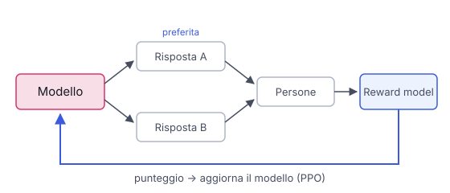

# IT

## In una frase

L'RLHF avvicina il modello a ciò che le persone preferiscono: si allena un giudice sulle loro scelte, poi il modello impara a soddisfarlo.

## Approfondimento

L'RLHF (reinforcement learning from human feedback, apprendimento per rinforzo dal feedback umano) parte da un modello che già segue istruzioni. Il modello genera due o più risposte alla stessa domanda e delle persone indicano quale preferiscono. Con molti confronti di questo tipo si addestra un **reward model**, un modello giudice che dà un punteggio a qualsiasi risposta.

Poi entra in gioco l'apprendimento per rinforzo, spesso con un algoritmo chiamato PPO. Il modello scrive risposte, il giudice le valuta e i pesi si spostano verso ciò che ottiene punteggi alti. Una penalità lo tiene vicino al modello di partenza, così non si snatura. Questa fase ha reso gli assistenti molto più utili, cortesi e prudenti.

I limiti sono reali. È costoso e instabile da allenare. Il modello può imparare a ingannare il giudice, per esempio con risposte lunghe o compiacenti che piacciono senza essere migliori. E riflette i gusti e i pregiudizi di chi ha votato.

## Esempio for dummies

Un pasticciere prepara due versioni della stessa torta e le fa assaggiare ai clienti. Non chiede un voto da uno a dieci, solo "quale preferisci?". Dopo mesi ha un aiutante che sa prevedere i gusti della clientela. Da quel momento prova ricette nuove e le fa giudicare all'aiutante. Il rischio? Scoprire che più zucchero vince sempre, e finire a sfornare dolci stucchevoli.

## Errore comune

Si crede che il modello impari in tempo reale dai pollici in su degli utenti. L'RLHF è una fase di addestramento separata, fatta prima del rilascio. Le valutazioni raccolte durante l'uso possono, al massimo, servire per una versione futura.

## Didascalia della figura

Le persone scelgono la risposta migliore, un reward model impara a dare punteggi e l'apprendimento per rinforzo aggiorna il modello.

# EN

## One line

RLHF steers a model towards what people prefer: a judge is trained on their choices, then the model learns to please that judge.

## Deep dive

RLHF (reinforcement learning from human feedback) starts from a model that already follows instructions. It generates two or more answers to the same prompt, and people pick the one they prefer. From many such comparisons you train a **reward model**: a judge that gives any answer a score.

Then reinforcement learning takes over, often with an algorithm called PPO. The model writes answers, the judge scores them, and the weights shift towards whatever scores high. A penalty keeps the model close to where it started so it doesn't drift into odd behaviour. This step is a big part of why assistants became more helpful, polite and careful.

The limits are real. It is expensive and unstable to train. The model can learn to game the judge, for example with long or flattering answers that score well without being better. And it reflects the tastes and biases of the people who voted.

## For dummies

A baker makes two versions of the same cake and lets customers taste both. He doesn't ask for a score out of ten, only "which one do you prefer?". After months he has an assistant who can predict the customers' taste. From then on he tries new recipes and lets the assistant judge them. The risk: learning that more sugar always wins, and ending up baking cloying cakes.

## Common mistake

People think the model learns live from users' thumbs-up. RLHF is a separate training phase done before release. Ratings collected during use can, at most, feed into a future version.

## Figure caption

People pick the better answer, a reward model learns to score answers, and reinforcement learning updates the model.
